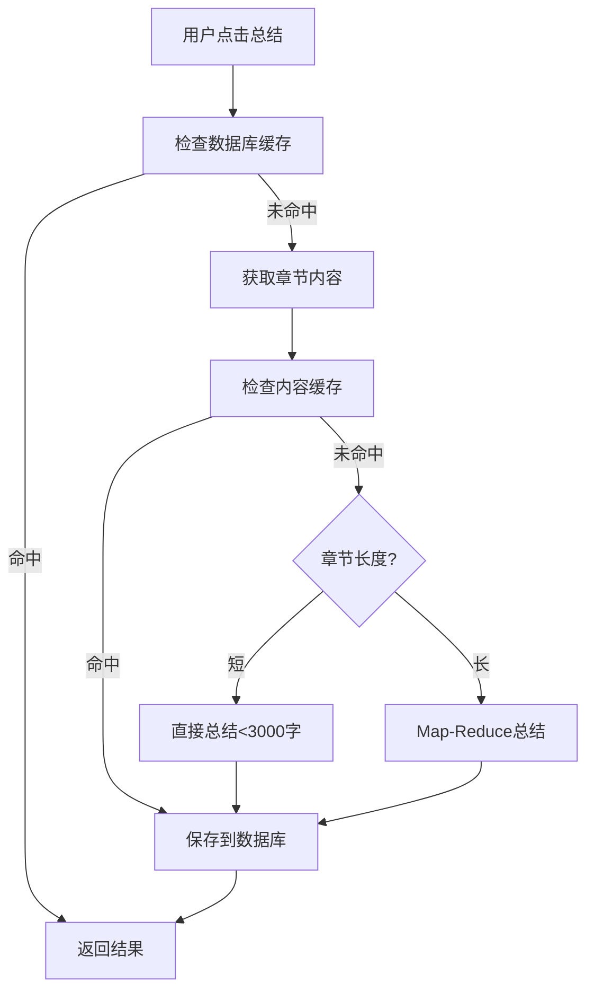

# AI 章节总结功能使用指南

## 概述

本项目已成功集成 AI 章节总结功能，基于 LangChain.js 框架实现，支持多个 AI 提供商（OpenAI、Anthropic Claude、智谱 GLM、阿里通义千问）。

## 功能特性

### 核心功能
- ✅ **章节智能总结**：使用 Map-Reduce 模式对长章节进行分块总结和递归摘要
- ✅ **多提供商支持**：OpenAI GPT-4/4o、Claude、智谱 GLM-4、通义千问
- ✅ **智能缓存**：双层缓存机制（数据库 + 内容哈希），避免重复调用 API
- ✅ **优雅降级**：短章节直接总结，长章节自动分块
- ✅ **实时生成**：前端实时显示生成进度和结果

### 架构优势
- 🏗️ **可扩展架构**：预留了问答对话、智能搜索、笔记整理等功能接口
- 🔌 **Provider 抽象层**：切换 AI 提供商无需修改业务代码
- 💾 **完善的缓存**：chapter_summaries（总结）+ ai_cache（通用 AI 调用）两张表
- 📊 **Token 计数**：内置 token 统计和成本追踪工具

## 使用方法

### 1. 配置 AI 服务

在应用设置中配置 AI 服务（目前需要手动在 electron-store 中配置）：

```json
{
  "ai": {
    "enabled": true,
    "provider": "openai",  // 可选: openai, claude, zhipu, qianwen
    "apiKey": "your-api-key-here",
    "model": "gpt-4o-mini",  // 推荐使用 mini 版本以降低成本
    "temperature": 0.7,
    "maxTokens": 2000
  }
}
```

### 2. 使用章节总结

1. 打开任意 EPUB 书籍进入阅读器
2. 点击顶部工具栏的**文档图标**（📄）按钮
3. 在右侧弹出的面板中点击"生成总结"
4. 等待 AI 生成总结（通常 10-30 秒）
5. 查看总结结果，可选择重新生成或删除

### 3. 总结特点

- **中等长度**：每章总结约 200-500 字
- **结构化内容**：包含主要内容、核心观点、重要人物/概念
- **语言流畅**：保持逻辑连贯，客观准确
- **智能分块**：长章节（>3000 字）自动使用 Map-Reduce 模式

## 技术实现

### 目录结构

```
src/main/ai/
├── providers/              # LLM 提供商适配器
│   ├── base.ts            # 统一接口定义
│   ├── openai.ts          # OpenAI GPT-4/4o
│   ├── anthropic.ts       # Anthropic Claude
│   ├── zhipu.ts           # 智谱 GLM-4
│   └── qianwen.ts         # 阿里通义千问
├── services/
│   └── SummaryService.ts  # 章节总结服务（核心）
├── chains/
│   └── summarize.ts       # Map-Reduce 总结链
├── utils/
│   ├── textSplitter.ts    # 文本分块工具
│   ├── cache.ts           # 缓存管理
│   └── tokenCounter.ts    # Token 计数
└── index.ts

src/main/ipc/handlers/
└── ai.ts                  # AI IPC 处理器

src/renderer/src/modules/ai/
├── hooks/
│   └── useChapterSummary.ts   # React Hook
└── components/
    └── ChapterSummaryPanel.tsx # 总结面板 UI
```

### 数据库表

```sql
-- 章节总结表
CREATE TABLE chapter_summaries (
  id TEXT PRIMARY KEY,
  book_id TEXT NOT NULL,
  chapter_index INTEGER NOT NULL,
  chapter_title TEXT,
  summary TEXT NOT NULL,
  model TEXT NOT NULL,
  created_at INTEGER DEFAULT (strftime('%s', 'now')),
  UNIQUE(book_id, chapter_index)
);

-- AI 缓存表
CREATE TABLE ai_cache (
  id TEXT PRIMARY KEY,
  cache_key TEXT UNIQUE NOT NULL,  -- 基于内容哈希
  response TEXT NOT NULL,
  model TEXT NOT NULL,
  created_at INTEGER DEFAULT (strftime('%s', 'now'))
);
```

### 核心流程



## 扩展开发

### 添加新的 AI 提供商

1. 在 `src/main/ai/providers/` 创建新文件
2. 实现 `AIProvider` 接口
3. 在 `providers/index.ts` 的工厂函数中添加
4. 更新类型定义支持新的 provider

示例：

```typescript
// src/main/ai/providers/custom.ts
export class CustomProvider implements AIProvider {
  public readonly provider = 'custom';
  public readonly model: ChatOpenAI;

  constructor(config: AIConfig) {
    // 初始化模型
  }

  async generateText(prompt: string): Promise<string> {
    // 实现生成逻辑
  }

  // ...其他接口方法
}
```

### 添加新的 AI 功能

在 `src/main/ai/services/` 创建新的服务类，例如：

```typescript
// src/main/ai/services/QAService.ts
export class QAService {
  async askQuestion(
    bookId: string,
    question: string,
    history: Message[]
  ): Promise<string> {
    // 基于书籍内容的问答对话
    // 可以使用向量数据库进行语义搜索
  }
}
```

然后在 IPC Handler、前端 Hook 和 UI 组件中添加对应的集成代码。

## 成本优化建议

1. **使用 mini 模型**：`gpt-4o-mini` 比 `gpt-4` 便宜 90%
2. **启用缓存**：默认已启用，避免重复总结
3. **控制章节长度**：极长章节可以手动分段总结
4. **选择国内模型**：智谱 GLM-4-flash 和通义千问成本更低

### 成本参考（每百万 tokens）

| 模型 | Input | Output | 适用场景 |
|------|-------|--------|---------|
| gpt-4o-mini | $0.15 | $0.6 | 推荐，性价比最高 |
| gpt-4o | $2.5 | $10 | 高质量要求 |
| claude-3-5-sonnet | $3 | $15 | 高质量要求 |
| glm-4-flash | ¥0.001 | ¥0.001 | 国内，超低成本 |
| qwen-plus | ¥0.4 | ¥0.4 | 国内，平衡 |

## 故障排查

### 问题：生成总结失败

**可能原因**：
1. API Key 未配置或无效
2. 网络连接问题（国内需要代理）
3. 余额不足
4. 章节内容为空

**解决方法**：
1. 检查设置中的 API Key 配置
2. 确保网络可以访问 AI 服务（国内用户可能需要设置代理或使用国内模型）
3. 查看控制台日志获取详细错误信息

### 问题：总结质量不佳

**优化方法**：
1. 调整 Prompt 模板（在 `src/main/ai/chains/summarize.ts`）
2. 尝试不同的模型
3. 调整 temperature 参数（0.5-0.9）
4. 增加或减少 maxTokens

## 后续规划

### 已完成 ✅
- [x] 章节总结（Map-Reduce 模式）
- [x] 多 AI 提供商支持
- [x] 缓存机制
- [x] 前端集成

### 计划中 🔜
- [ ] 智能搜索（RAG + 向量数据库）
- [ ] 问答对话（ConversationalChain）
- [ ] 智能笔记整理（LangGraph）
- [ ] 段落解释（划词解释）
- [ ] AI 设置界面

## 贡献指南

欢迎提交 PR 改进 AI 功能！重点方向：

1. 添加更多 AI 提供商
2. 优化 Prompt 模板提升总结质量
3. 实现新的 AI 功能（问答、搜索等）
4. 改进缓存策略
5. 添加成本统计和管理功能

## 许可证

本项目遵循 MIT 许可证。
