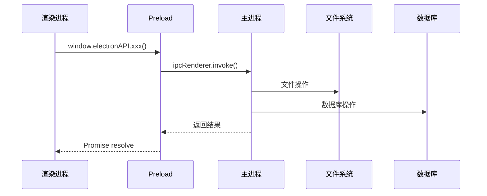

# K-Reader API设计文档

## 1. 文档概述

本文档详细描述K-Reader的API设计，包括：
- IPC通信接口（主进程与渲染进程）
- 云端REST API接口
- WebSocket实时同步协议
- 第三方服务集成接口

## 2. IPC通信接口

### 2.1 IPC架构设计



### 2.2 通道命名规范

格式：`模块:操作[:子操作]`

示例：
- `window:minimize` - 窗口最小化
- `book:import` - 书籍导入
- `annotation:create` - 创建批注
- `sync:start` - 开始同步

### 2.3 IPC通道定义

#### 2.3.1 窗口管理（Window）

**window:minimize**
```typescript
// 渲染进程调用
await window.electronAPI.window.minimize();

// 返回
void
```

**window:maximize**
```typescript
await window.electronAPI.window.maximize();
```

**window:close**
```typescript
await window.electronAPI.window.close();
```

**window:getBounds**
```typescript
const bounds = await window.electronAPI.window.getBounds();

// 返回
interface WindowBounds {
  x: number;
  y: number;
  width: number;
  height: number;
}
```

**window:setBounds**
```typescript
await window.electronAPI.window.setBounds({
  x: 100,
  y: 100,
  width: 1200,
  height: 800
});
```

#### 2.3.2 文件操作（File）

**file:select**
```typescript
const filePaths = await window.electronAPI.file.select({
  title: '选择EPUB文件',
  filters: [
    { name: 'EPUB文件', extensions: ['epub'] },
    { name: '所有文件', extensions: ['*'] }
  ],
  properties: ['openFile', 'multiSelections']
});

// 返回
string[]
```

**file:selectDirectory**
```typescript
const dirPath = await window.electronAPI.file.selectDirectory({
  title: '选择文件夹'
});

// 返回
string | null
```

**file:read**
```typescript
const content = await window.electronAPI.file.read({
  path: '/path/to/file',
  encoding: 'utf8' // 可选，默认'utf8'
});

// 返回
string | Buffer
```

**file:write**
```typescript
await window.electronAPI.file.write({
  path: '/path/to/file',
  content: 'file content',
  encoding: 'utf8'
});
```

**file:delete**
```typescript
await window.electronAPI.file.delete('/path/to/file');
```

**file:exists**
```typescript
const exists = await window.electronAPI.file.exists('/path/to/file');

// 返回
boolean
```

**file:getInfo**
```typescript
const info = await window.electronAPI.file.getInfo('/path/to/file');

// 返回
interface FileInfo {
  size: number;
  created: Date;
  modified: Date;
  isDirectory: boolean;
  isFile: boolean;
}
```

#### 2.3.3 书籍管理（Book）

**book:import**
```typescript
const book = await window.electronAPI.book.import({
  filePath: '/path/to/book.epub',
  extractMetadata: true,
  extractCover: true
});

// 返回
interface Book {
  id: string;
  title: string;
  author: string;
  publisher: string;
  coverUrl: string;
  filePath: string;
  fileSize: number;
  format: 'epub' | 'pdf';
  metadata: Record<string, any>;
  addedAt: Date;
}
```

**book:getAll**
```typescript
const books = await window.electronAPI.book.getAll({
  sortBy: 'lastReadAt', // 可选
  sortOrder: 'desc',    // 可选
  limit: 50,            // 可选
  offset: 0             // 可选
});

// 返回
Book[]
```

**book:get**
```typescript
const book = await window.electronAPI.book.get(bookId);

// 返回
Book | null
```

**book:update**
```typescript
await window.electronAPI.book.update(bookId, {
  title: '新标题',
  author: '新作者',
  tags: ['小说', '科幻']
});
```

**book:delete**
```typescript
await window.electronAPI.book.delete(bookId, {
  deleteFile: false // 是否删除文件，默认false
});
```

**book:search**
```typescript
const results = await window.electronAPI.book.search({
  query: '关键词',
  fields: ['title', 'author'], // 搜索字段
  limit: 20
});

// 返回
Book[]
```

**book:extractMetadata**
```typescript
const metadata = await window.electronAPI.book.extractMetadata(filePath);

// 返回
interface BookMetadata {
  title: string;
  author: string;
  publisher: string;
  publishDate: string;
  isbn: string;
  language: string;
  description: string;
  toc: TOCItem[];
  spine: SpineItem[];
}
```

**book:extractCover**
```typescript
const coverPath = await window.electronAPI.book.extractCover(filePath);

// 返回
string // 封面图片路径
```

#### 2.3.4 批注管理（Annotation）

**annotation:create**
```typescript
const annotation = await window.electronAPI.annotation.create({
  bookId: 'book-id',
  type: 'highlight',
  cfi: 'epubcfi(/6/4[chap01ref]!/4/2/2[title-id],/1:0,/1:20)',
  cfiRange: 'epubcfi(...)',
  selectedText: '选中的文本',
  note: '我的笔记',
  color: '#ffeb3b',
  chapterIndex: 0,
  chapterTitle: '第一章'
});

// 返回
interface Annotation {
  id: string;
  bookId: string;
  type: 'highlight' | 'underline' | 'note' | 'bookmark';
  cfi: string;
  cfiRange: string;
  selectedText: string;
  note: string;
  color: string;
  chapterIndex: number;
  chapterTitle: string;
  createdAt: Date;
  updatedAt: Date;
}
```

**annotation:getAll**
```typescript
const annotations = await window.electronAPI.annotation.getAll({
  bookId: 'book-id',
  type: 'highlight', // 可选
  sortBy: 'createdAt',
  sortOrder: 'desc'
});

// 返回
Annotation[]
```

**annotation:update**
```typescript
await window.electronAPI.annotation.update(annotationId, {
  note: '更新的笔记',
  color: '#4caf50'
});
```

**annotation:delete**
```typescript
await window.electronAPI.annotation.delete(annotationId);
```

**annotation:export**
```typescript
const result = await window.electronAPI.annotation.export({
  bookId: 'book-id',
  format: 'markdown', // 'markdown' | 'json' | 'pdf'
  outputPath: '/path/to/output.md' // 可选
});

// 返回
interface ExportResult {
  success: boolean;
  filePath: string;
  error?: string;
}
```

#### 2.3.5 阅读进度（Progress）

**progress:save**
```typescript
await window.electronAPI.progress.save({
  bookId: 'book-id',
  currentCFI: 'epubcfi(...)',
  currentChapter: 5,
  progressPercentage: 45.5,
  currentPage: 123,
  totalPages: 300
});
```

**progress:get**
```typescript
const progress = await window.electronAPI.progress.get(bookId);

// 返回
interface ReadingProgress {
  bookId: string;
  currentCFI: string;
  currentChapter: number;
  progressPercentage: number;
  currentPage: number;
  totalPages: number;
  readingTime: number; // 秒
  lastReadAt: Date;
}
```

**progress:addTime**
```typescript
await window.electronAPI.progress.addTime({
  bookId: 'book-id',
  seconds: 60
});
```

#### 2.3.6 标签管理（Tag）

**tag:create**
```typescript
const tag = await window.electronAPI.tag.create({
  name: '科幻',
  color: '#2196f3'
});

// 返回
interface Tag {
  id: string;
  name: string;
  color: string;
}
```

**tag:getAll**
```typescript
const tags = await window.electronAPI.tag.getAll();

// 返回
Tag[]
```

**tag:addToBook**
```typescript
await window.electronAPI.tag.addToBook({
  bookId: 'book-id',
  tagId: 'tag-id'
});
```

**tag:removeFromBook**
```typescript
await window.electronAPI.tag.removeFromBook({
  bookId: 'book-id',
  tagId: 'tag-id'
});
```

#### 2.3.7 设置管理（Settings）

**settings:get**
```typescript
const value = await window.electronAPI.settings.get('theme');

// 返回所有设置
const allSettings = await window.electronAPI.settings.get();

// 返回
any | Record<string, any>
```

**settings:set**
```typescript
await window.electronAPI.settings.set('theme', 'dark');

// 批量设置
await window.electronAPI.settings.set({
  theme: 'dark',
  fontSize: 16,
  fontFamily: 'serif'
});
```

**settings:delete**
```typescript
await window.electronAPI.settings.delete('key');
```

**settings:clear**
```typescript
await window.electronAPI.settings.clear();
```

#### 2.3.8 数据库操作（Database）

**db:query**
```typescript
const results = await window.electronAPI.db.query(
  'SELECT * FROM books WHERE author = ?',
  ['作者名']
);

// 返回
any[]
```

**db:execute**
```typescript
const result = await window.electronAPI.db.execute(
  'UPDATE books SET title = ? WHERE id = ?',
  ['新标题', 'book-id']
);

// 返回
interface ExecuteResult {
  changes: number;
  lastInsertRowid: number;
}
```

**db:transaction**
```typescript
await window.electronAPI.db.transaction(async (tx) => {
  await tx.execute('INSERT INTO books ...');
  await tx.execute('INSERT INTO tags ...');
});
```

#### 2.3.9 云同步（Sync）

**sync:start**
```typescript
await window.electronAPI.sync.start({
  syncBooks: true,
  syncAnnotations: true,
  syncProgress: true,
  syncSettings: true
});
```

**sync:stop**
```typescript
await window.electronAPI.sync.stop();
```

**sync:getStatus**
```typescript
const status = await window.electronAPI.sync.getStatus();

// 返回
interface SyncStatus {
  isRunning: boolean;
  lastSyncAt: Date;
  isSyncing: boolean;
  progress: number; // 0-100
  error: string | null;
}
```

**sync:manual**
```typescript
await window.electronAPI.sync.manual({
  resourceType: 'annotations',
  bookId: 'book-id'
});
```

#### 2.3.10 系统操作（System）

**system:openExternal**
```typescript
await window.electronAPI.system.openExternal('https://example.com');
```

**system:showItemInFolder**
```typescript
await window.electronAPI.system.showItemInFolder('/path/to/file');
```

**system:getAppPath**
```typescript
const path = await window.electronAPI.system.getAppPath('userData');

// 返回
string
```

**system:getVersion**
```typescript
const version = await window.electronAPI.system.getVersion();

// 返回
interface VersionInfo {
  app: string;
  electron: string;
  chrome: string;
  node: string;
}
```

### 2.4 Preload脚本实现

```typescript
// preload.ts
import { contextBridge, ipcRenderer } from 'electron';

// 定义API类型
interface ElectronAPI {
  window: {
    minimize: () => Promise<void>;
    maximize: () => Promise<void>;
    close: () => Promise<void>;
    getBounds: () => Promise<WindowBounds>;
    setBounds: (bounds: Partial<WindowBounds>) => Promise<void>;
  };
  
  file: {
    select: (options: SelectFileOptions) => Promise<string[]>;
    selectDirectory: (options: SelectDirectoryOptions) => Promise<string | null>;
    read: (options: ReadFileOptions) => Promise<string | Buffer>;
    write: (options: WriteFileOptions) => Promise<void>;
    delete: (path: string) => Promise<void>;
    exists: (path: string) => Promise<boolean>;
    getInfo: (path: string) => Promise<FileInfo>;
  };
  
  book: {
    import: (options: ImportBookOptions) => Promise<Book>;
    getAll: (options?: GetBooksOptions) => Promise<Book[]>;
    get: (id: string) => Promise<Book | null>;
    update: (id: string, updates: Partial<Book>) => Promise<void>;
    delete: (id: string, options?: DeleteBookOptions) => Promise<void>;
    search: (options: SearchBooksOptions) => Promise<Book[]>;
    extractMetadata: (filePath: string) => Promise<BookMetadata>;
    extractCover: (filePath: string) => Promise<string>;
  };
  
  annotation: {
    create: (data: CreateAnnotationData) => Promise<Annotation>;
    getAll: (options: GetAnnotationsOptions) => Promise<Annotation[]>;
    update: (id: string, updates: Partial<Annotation>) => Promise<void>;
    delete: (id: string) => Promise<void>;
    export: (options: ExportAnnotationsOptions) => Promise<ExportResult>;
  };
  
  progress: {
    save: (data: SaveProgressData) => Promise<void>;
    get: (bookId: string) => Promise<ReadingProgress>;
    addTime: (data: AddTimeData) => Promise<void>;
  };
  
  tag: {
    create: (data: CreateTagData) => Promise<Tag>;
    getAll: () => Promise<Tag[]>;
    addToBook: (data: AddTagToBookData) => Promise<void>;
    removeFromBook: (data: RemoveTagFromBookData) => Promise<void>;
  };
  
  settings: {
    get: (key?: string) => Promise<any>;
    set: (key: string | Record<string, any>, value?: any) => Promise<void>;
    delete: (key: string) => Promise<void>;
    clear: () => Promise<void>;
  };
  
  db: {
    query: (sql: string, params?: any[]) => Promise<any[]>;
    execute: (sql: string, params?: any[]) => Promise<ExecuteResult>;
    transaction: (callback: (tx: Transaction) => Promise<void>) => Promise<void>;
  };
  
  sync: {
    start: (options: SyncOptions) => Promise<void>;
    stop: () => Promise<void>;
    getStatus: () => Promise<SyncStatus>;
    manual: (options: ManualSyncOptions) => Promise<void>;
  };
  
  system: {
    openExternal: (url: string) => Promise<void>;
    showItemInFolder: (path: string) => Promise<void>;
    getAppPath: (name: string) => Promise<string>;
    getVersion: () => Promise<VersionInfo>;
  };
}

// 实现API
const electronAPI: ElectronAPI = {
  window: {
    minimize: () => ipcRenderer.invoke('window:minimize'),
    maximize: () => ipcRenderer.invoke('window:maximize'),
    close: () => ipcRenderer.invoke('window:close'),
    getBounds: () => ipcRenderer.invoke('window:getBounds'),
    setBounds: (bounds) => ipcRenderer.invoke('window:setBounds', bounds),
  },
  
  file: {
    select: (options) => ipcRenderer.invoke('file:select', options),
    selectDirectory: (options) => ipcRenderer.invoke('file:selectDirectory', options),
    read: (options) => ipcRenderer.invoke('file:read', options),
    write: (options) => ipcRenderer.invoke('file:write', options),
    delete: (path) => ipcRenderer.invoke('file:delete', path),
    exists: (path) => ipcRenderer.invoke('file:exists', path),
    getInfo: (path) => ipcRenderer.invoke('file:getInfo', path),
  },
  
  // ... 其他模块实现
};

// 暴露API
contextBridge.exposeInMainWorld('electronAPI', electronAPI);

// 类型声明
declare global {
  interface Window {
    electronAPI: ElectronAPI;
  }
}
```

## 3. 云端REST API

### 3.1 API基础信息

**Base URL**: `https://api.kreader.com/v1`

**认证方式**: JWT Bearer Token

**请求头**:
```
Authorization: Bearer <token>
Content-Type: application/json
```

**响应格式**:
```json
{
  "success": true,
  "data": {},
  "message": "操作成功",
  "timestamp": 1234567890
}
```

**错误响应**:
```json
{
  "success": false,
  "error": {
    "code": "INVALID_REQUEST",
    "message": "请求参数错误",
    "details": {}
  },
  "timestamp": 1234567890
}
```

### 3.2 认证接口

#### POST /auth/register
注册新用户

**请求**:
```json
{
  "email": "user@example.com",
  "password": "password123",
  "username": "username"
}
```

**响应**:
```json
{
  "success": true,
  "data": {
    "user": {
      "id": "user-id",
      "email": "user@example.com",
      "username": "username",
      "createdAt": "2024-01-01T00:00:00Z"
    },
    "token": "jwt-token"
  }
}
```

#### POST /auth/login
用户登录

**请求**:
```json
{
  "email": "user@example.com",
  "password": "password123"
}
```

**响应**:
```json
{
  "success": true,
  "data": {
    "user": {
      "id": "user-id",
      "email": "user@example.com",
      "username": "username"
    },
    "token": "jwt-token",
    "refreshToken": "refresh-token"
  }
}
```

#### POST /auth/refresh
刷新Token

**请求**:
```json
{
  "refreshToken": "refresh-token"
}
```

**响应**:
```json
{
  "success": true,
  "data": {
    "token": "new-jwt-token",
    "refreshToken": "new-refresh-token"
  }
}
```

#### POST /auth/logout
登出

**响应**:
```json
{
  "success": true,
  "message": "登出成功"
}
```

### 3.3 书籍同步接口

#### GET /sync/books
获取用户所有书籍元数据

**查询参数**:
- `since`: 时间戳，增量同步
- `limit`: 数量限制
- `offset`: 偏移量

**响应**:
```json
{
  "success": true,
  "data": {
    "books": [
      {
        "id": "book-id",
        "title": "书名",
        "author": "作者",
        "metadata": {},
        "updatedAt": "2024-01-01T00:00:00Z",
        "version": 1
      }
    ],
    "total": 100,
    "hasMore": true
  }
}
```

#### POST /sync/books
上传书籍元数据

**请求**:
```json
{
  "books": [
    {
      "id": "book-id",
      "title": "书名",
      "author": "作者",
      "metadata": {},
      "localUpdatedAt": "2024-01-01T00:00:00Z"
    }
  ]
}
```

**响应**:
```json
{
  "success": true,
  "data": {
    "synced": ["book-id-1"],
    "conflicts": [
      {
        "bookId": "book-id-2",
        "localVersion": 1,
        "remoteVersion": 2
      }
    ]
  }
}
```

#### DELETE /sync/books/:bookId
删除书籍

**响应**:
```json
{
  "success": true,
  "message": "删除成功"
}
```

### 3.4 批注同步接口

#### GET /sync/annotations
获取批注

**查询参数**:
- `bookId`: 书籍ID（可选）
- `since`: 时间戳
- `limit`: 数量限制

**响应**:
```json
{
  "success": true,
  "data": {
    "annotations": [
      {
        "id": "annotation-id",
        "bookId": "book-id",
        "type": "highlight",
        "cfi": "epubcfi(...)",
        "selectedText": "文本",
        "note": "笔记",
        "color": "#ffeb3b",
        "createdAt": "2024-01-01T00:00:00Z",
        "updatedAt": "2024-01-01T00:00:00Z",
        "version": 1
      }
    ],
    "total": 50,
    "hasMore": false
  }
}
```

#### POST /sync/annotations
上传批注

**请求**:
```json
{
  "annotations": [
    {
      "id": "annotation-id",
      "bookId": "book-id",
      "type": "highlight",
      "cfi": "epubcfi(...)",
      "selectedText": "文本",
      "note": "笔记",
      "color": "#ffeb3b",
      "localUpdatedAt": "2024-01-01T00:00:00Z"
    }
  ]
}
```

**响应**:
```json
{
  "success": true,
  "data": {
    "synced": ["annotation-id-1"],
    "conflicts": []
  }
}
```

#### DELETE /sync/annotations/:annotationId
删除批注

**响应**:
```json
{
  "success": true
}
```

### 3.5 阅读进度同步接口

#### GET /sync/progress
获取阅读进度

**查询参数**:
- `bookId`: 书籍ID（可选）
- `since`: 时间戳

**响应**:
```json
{
  "success": true,
  "data": {
    "progress": [
      {
        "bookId": "book-id",
        "currentCFI": "epubcfi(...)",
        "progressPercentage": 45.5,
        "readingTime": 3600,
        "updatedAt": "2024-01-01T00:00:00Z"
      }
    ]
  }
}
```

#### POST /sync/progress
上传阅读进度

**请求**:
```json
{
  "progress": [
    {
      "bookId": "book-id",
      "currentCFI": "epubcfi(...)",
      "currentChapter": 5,
      "progressPercentage": 45.5,
      "currentPage": 123,
      "totalPages": 300,
      "readingTime": 3600,
      "localUpdatedAt": "2024-01-01T00:00:00Z"
    }
  ]
}
```

**响应**:
```json
{
  "success": true,
  "data": {
    "synced": ["book-id-1"]
  }
}
```

### 3.6 设置同步接口

#### GET /sync/settings
获取设置

**响应**:
```json
{
  "success": true,
  "data": {
    "settings": {
      "theme": "dark",
      "fontSize": 16,
      "fontFamily": "serif",
      "updatedAt": "2024-01-01T00:00:00Z"
    }
  }
}
```

#### POST /sync/settings
上传设置

**请求**:
```json
{
  "settings": {
    "theme": "dark",
    "fontSize": 16,
    "fontFamily": "serif"
  }
}
```

**响应**:
```json
{
  "success": true
}
```

### 3.7 文件存储接口

#### POST /storage/upload
上传文件

**请求**: `multipart/form-data`
```
file: <binary>
type: cover | book
```

**响应**:
```json
{
  "success": true,
  "data": {
    "fileId": "file-id",
    "url": "https://cdn.kreader.com/files/xxx",
    "size": 1024000
  }
}
```

#### GET /storage/download/:fileId
下载文件

**响应**: 文件二进制流

### 3.8 用户信息接口

#### GET /user/profile
获取用户信息

**响应**:
```json
{
  "success": true,
  "data": {
    "user": {
      "id": "user-id",
      "email": "user@example.com",
      "username": "username",
      "avatar": "https://...",
      "createdAt": "2024-01-01T00:00:00Z",
      "storageUsed": 1024000,
      "storageLimit": 10240000
    }
  }
}
```

#### PUT /user/profile
更新用户信息

**请求**:
```json
{
  "username": "new-username",
  "avatar": "https://..."
}
```

**响应**:
```json
{
  "success": true,
  "data": {
    "user": {
      // 更新后的用户信息
    }
  }
}
```

## 4. WebSocket实时同步协议

### 4.1 连接

**URL**: `wss://api.kreader.com/ws`

**认证**: 连接时发送认证消息
```json
{
  "type": "auth",
  "data": {
    "token": "jwt-token"
  }
}
```

### 4.2 消息格式

**客户端→服务器**:
```json
{
  "type": "message-type",
  "id": "message-id",
  "data": {}
}
```

**服务器→客户端**:
```json
{
  "type": "message-type",
  "id": "message-id",
  "data": {},
  "timestamp": 1234567890
}
```

### 4.3 消息类型

#### 心跳（ping/pong）
```json
// 客户端
{ "type": "ping" }

// 服务器
{ "type": "pong" }
```

#### 同步通知（sync-notify）
服务器通知客户端有数据更新
```json
{
  "type": "sync-notify",
  "data": {
    "resourceType": "annotations",
    "bookId": "book-id",
    "action": "create",
    "resourceId": "annotation-id"
  }
}
```

#### 同步请求（sync-request）
客户端请求同步数据
```json
{
  "type": "sync-request",
  "id": "req-1",
  "data": {
    "resourceType": "annotations",
    "bookId": "book-id",
    "since": 1234567890
  }
}
```

#### 同步响应（sync-response）
服务器响应同步数据
```json
{
  "type": "sync-response",
  "id": "req-1",
  "data": {
    "annotations": [...]
  }
}
```

#### 进度更新（progress-update）
实时更新阅读进度
```json
{
  "type": "progress-update",
  "data": {
    "bookId": "book-id",
    "progressPercentage": 50.5,
    "currentCFI": "epubcfi(...)"
  }
}
```

## 5. 第三方服务API集成

### 5.1 OpenAI API

**配置**:
```typescript
import OpenAI from 'openai';

const openai = new OpenAI({
  apiKey: process.env.OPENAI_API_KEY,
  baseURL: process.env.OPENAI_BASE_URL // 可选
});
```

**聊天接口**:
```typescript
const completion = await openai.chat.completions.create({
  model: 'gpt-4',
  messages: [
    {
      role: 'system',
      content: '你是一个阅读助手'
    },
    {
      role: 'user',
      content: '请总结这段内容'
    }
  ],
  temperature: 0.7,
  max_tokens: 1000
});
```

**流式响应**:
```typescript
const stream = await openai.chat.completions.create({
  model: 'gpt-4',
  messages: messages,
  stream: true
});

for await (const chunk of stream) {
  const content = chunk.choices[0]?.delta?.content;
  if (content) {
    // 处理流式内容
  }
}
```

### 5.2 翻译API

#### 有道翻译API

**接口**: `https://openapi.youdao.com/api`

**请求**:
```typescript
interface YoudaoTranslateRequest {
  q: string;      // 待翻译文本
  from: string;   // 源语言
  to: string;     // 目标语言
  appKey: string;
  salt: string;   // 随机数
  sign: string;   // 签名
}
```

**响应**:
```json
{
  "errorCode": "0",
  "translation": ["翻译结果"],
  "basic": {
    "explains": ["解释1", "解释2"]
  }
}
```

#### DeepL API

**接口**: `https://api-free.deepl.com/v2/translate`

**请求**:
```typescript
interface DeepLTranslateRequest {
  text: string[];
  source_lang: string;
  target_lang: string;
  auth_key: string;
}
```

**响应**:
```json
{
  "translations": [
    {
      "detected_source_language": "EN",
      "text": "翻译结果"
    }
  ]
}
```

### 5.3 TTS API

#### Azure TTS

**接口**: `https://<region>.tts.speech.microsoft.com/cognitiveservices/v1`

**请求**:
```xml
<speak version='1.0' xml:lang='zh-CN'>
  <voice name='zh-CN-XiaoxiaoNeural'>
    要朗读的文本
  </voice>
</speak>
```

**响应**: 音频流（MP3/WAV）

#### Google TTS

**接口**: `https://texttospeech.googleapis.com/v1/text:synthesize`

**请求**:
```json
{
  "input": {
    "text": "要朗读的文本"
  },
  "voice": {
    "languageCode": "zh-CN",
    "name": "zh-CN-Wavenet-A"
  },
  "audioConfig": {
    "audioEncoding": "MP3"
  }
}
```

**响应**:
```json
{
  "audioContent": "base64编码的音频"
}
```

## 6. 错误码定义

### 6.1 通用错误码

| 错误码 | 说明 | HTTP状态码 |
|--------|------|-----------|
| SUCCESS | 成功 | 200 |
| INVALID_REQUEST | 请求参数错误 | 400 |
| UNAUTHORIZED | 未授权 | 401 |
| FORBIDDEN | 禁止访问 | 403 |
| NOT_FOUND | 资源不存在 | 404 |
| CONFLICT | 资源冲突 | 409 |
| RATE_LIMIT | 请求过于频繁 | 429 |
| INTERNAL_ERROR | 服务器内部错误 | 500 |
| SERVICE_UNAVAILABLE | 服务不可用 | 503 |

### 6.2 业务错误码

| 错误码 | 说明 |
|--------|------|
| AUTH_INVALID_CREDENTIALS | 用户名或密码错误 |
| AUTH_TOKEN_EXPIRED | Token已过期 |
| AUTH_TOKEN_INVALID | Token无效 |
| USER_ALREADY_EXISTS | 用户已存在 |
| USER_NOT_FOUND | 用户不存在 |
| BOOK_NOT_FOUND | 书籍不存在 |
| BOOK_ALREADY_EXISTS | 书籍已存在 |
| ANNOTATION_NOT_FOUND | 批注不存在 |
| SYNC_CONFLICT | 同步冲突 |
| STORAGE_QUOTA_EXCEEDED | 存储空间不足 |
| FILE_TOO_LARGE | 文件过大 |
| UNSUPPORTED_FORMAT | 不支持的文件格式 |

## 7. API安全

### 7.1 认证与授权

- 使用JWT进行身份认证
- Token有效期：1小时
- Refresh Token有效期：30天
- 使用HTTPS加密传输

### 7.2 请求限制

- 普通用户：100请求/分钟
- 付费用户：1000请求/分钟
- 超出限制返回429错误

### 7.3 数据加密

- 敏感数据使用AES-256加密
- 密码使用bcrypt哈希
- API通信使用HTTPS

### 7.4 CORS配置

```typescript
{
  origin: ['https://app.kreader.com'],
  methods: ['GET', 'POST', 'PUT', 'DELETE'],
  allowedHeaders: ['Content-Type', 'Authorization'],
  credentials: true
}
```

## 8. API版本管理

### 8.1 版本策略

- URL版本控制：`/v1/`, `/v2/`
- 向后兼容：至少保持2个版本
- 废弃通知：提前3个月通知

### 8.2 版本变更

**v1（当前版本）**:
- 基础功能API
- 同步接口
- 认证授权

**v2（计划中）**:
- GraphQL支持
- 批量操作优化
- 更细粒度的权限控制

## 9. API测试

### 9.1 单元测试示例

```typescript
describe('Book API', () => {
  it('should import book', async () => {
    const book = await window.electronAPI.book.import({
      filePath: '/path/to/test.epub'
    });
    
    expect(book).toBeDefined();
    expect(book.title).toBeTruthy();
  });
  
  it('should get all books', async () => {
    const books = await window.electronAPI.book.getAll();
    
    expect(Array.isArray(books)).toBe(true);
  });
});
```

### 9.2 集成测试示例

```typescript
describe('Sync API', () => {
  it('should sync annotations', async () => {
    // 创建本地批注
    const annotation = await window.electronAPI.annotation.create({
      bookId: 'test-book',
      type: 'highlight',
      cfi: 'epubcfi(...)',
      selectedText: 'test'
    });
    
    // 启动同步
    await window.electronAPI.sync.start({
      syncAnnotations: true
    });
    
    // 等待同步完成
    await waitForSync();
    
    // 验证远程数据
    const remoteAnnotations = await fetchRemoteAnnotations();
    expect(remoteAnnotations).toContainEqual(annotation);
  });
});
```

## 10. API文档生成

使用OpenAPI/Swagger生成交互式文档：

```yaml
openapi: 3.0.0
info:
  title: K-Reader API
  version: 1.0.0
  description: K-Reader云端API文档
servers:
  - url: https://api.kreader.com/v1
paths:
  /auth/login:
    post:
      summary: 用户登录
      tags:
        - Authentication
      requestBody:
        required: true
        content:
          application/json:
            schema:
              type: object
              properties:
                email:
                  type: string
                password:
                  type: string
      responses:
        '200':
          description: 登录成功
          content:
            application/json:
              schema:
                type: object
                properties:
                  success:
                    type: boolean
                  data:
                    type: object
```

## 11. 总结

本文档详细定义了K-Reader的所有API接口，包括：

✅ **IPC接口**：完整的主进程与渲染进程通信接口
✅ **REST API**：云端同步和数据管理接口
✅ **WebSocket**：实时同步协议
✅ **第三方集成**：AI、翻译、TTS服务接口

**设计原则**：
- **类型安全**：完整的TypeScript类型定义
- **一致性**：统一的命名和响应格式
- **可扩展**：模块化设计，易于扩展
- **安全性**：完善的认证和授权机制
- **文档化**：详细的接口说明和示例

该API设计为K-Reader的开发提供了清晰的接口规范，确保前后端高效协作！
