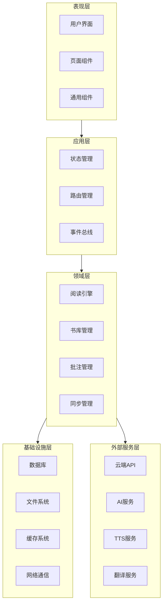
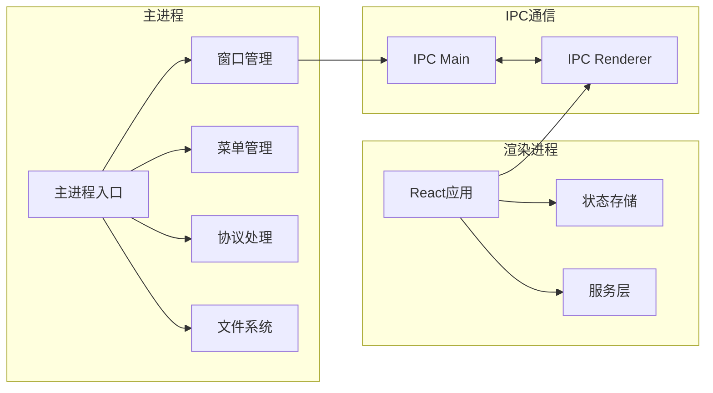
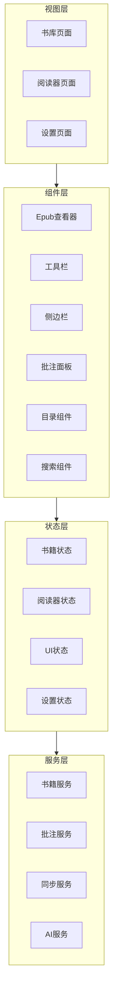
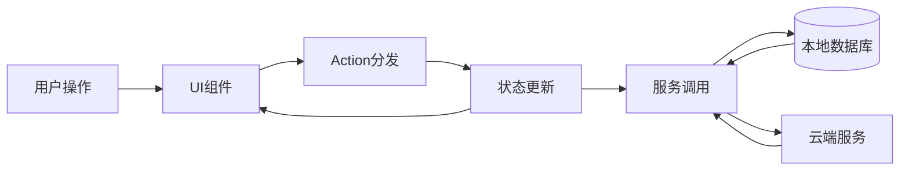

# K-Reader Epub阅读器 - 设计文档

## 1. 项目概述

### 1.1 项目简介

K-Reader是一款功能全面的PC端Epub阅读器，基于Electron跨平台框架开发，支持Windows、macOS和Linux系统。项目采用现代化的技术栈，提供优雅的阅读体验和强大的智能功能。

### 1.2 核心特性

- 📚 **完整的阅读体验**：支持EPUB2/3格式，提供分页和滚动两种阅读模式
- 🎨 **精美的界面设计**：基于React + TailwindCSS构建，支持多主题切换
- ✍️ **强大的批注系统**：高亮、笔记、书签，支持导出为Markdown/PDF
- ☁️ **云端同步**：多设备数据同步，随时随地继续阅读
- 🤖 **AI阅读助手**：智能摘要、段落解释、问答对话
- 🔊 **TTS语音朗读**：多语言、多音色，支持连续朗读
- 🌐 **划词翻译**：集成在线和离线词典，一键翻译
- 📖 **书库管理**：标签分类、智能搜索、元数据管理

### 1.3 技术优势

- **跨平台**：一套代码，支持三大桌面操作系统
- **高性能**：虚拟化渲染，大文件流畅加载
- **模块化**：清晰的架构设计，易于维护和扩展
- **类型安全**：TypeScript严格模式，减少运行时错误
- **离线优先**：本地数据优先，可选云端同步

## 2. 系统架构设计

### 2.1 整体架构

K-Reader采用经典的分层架构，将系统划分为五个主要层次：



### 2.2 Electron架构

采用Electron主进程与渲染进程分离的架构：



### 2.3 前端架构



### 2.4 数据流架构



## 3. 技术栈详解

### 3.1 核心框架

**Electron 28+**
- 作用：跨平台桌面应用基座
- 版本选择：28+支持最新的Node.js和Chromium
- 配置要点：禁用nodeIntegration，使用contextBridge确保安全

**React 18+**
- 作用：前端UI框架
- 版本选择：18+支持并发渲染和自动批处理
- 特性使用：Hooks、Suspense、Error Boundaries

**TypeScript 5+**
- 作用：静态类型检查
- 配置：strict模式，确保类型安全
- 优势：减少运行时错误，提升代码质量

### 3.2 UI与样式

**TailwindCSS 3+**
- 作用：原子化CSS框架
- 优势：快速开发，文件体积小，易于定制
- 配置：自定义主题色、字体、间距等

**Headless UI**
- 作用：无样式UI组件库
- 用途：模态框、下拉菜单、切换按钮等
- 优势：完全可定制，无障碍支持

**Framer Motion**
- 作用：动画库
- 用途：页面过渡、组件动画
- 优势：声明式API，性能优秀

### 3.3 状态管理

**Zustand**
- 作用：轻量级状态管理
- 优势：API简洁，无需Provider，支持中间件
- 用途：全局状态、持久化、开发工具

**React Query / TanStack Query**
- 作用：服务端状态管理
- 用途：异步数据获取、缓存、同步
- 优势：自动缓存、重新获取、乐观更新

### 3.4 阅读引擎

**epub.js 0.3+**
- 作用：EPUB解析和渲染
- 功能：CFI定位、分页、样式注入
- 定制：主题、字体、布局

### 3.5 数据存储

**better-sqlite3**
- 作用：SQLite数据库Node.js绑定
- 优势：同步API，性能优秀，支持主进程
- 用途：书籍元数据、批注、配置

**IndexedDB**
- 作用：浏览器端结构化存储
- 用途：缓存、临时数据
- 优势：大容量，异步API

**electron-store**
- 作用：配置文件存储
- 用途：用户偏好设置
- 优势：自动持久化，类型安全

### 3.6 网络通信

**Axios**
- 作用：HTTP客户端
- 用途：RESTful API调用
- 配置：拦截器、错误处理、超时

**Socket.io-client**
- 作用：WebSocket通信
- 用途：实时数据同步
- 优势：自动重连，跨平台

### 3.7 开发工具

**Vite**
- 作用：构建工具
- 优势：极速热更新，优化的生产构建
- 插件：React、TypeScript、Electron

**electron-builder**
- 作用：打包工具
- 用途：生成安装包，代码签名
- 支持：Windows、macOS、Linux

**ESLint + Prettier**
- 作用：代码检查和格式化
- 配置：TypeScript规则，React规则
- 集成：Git hooks，CI/CD

## 4. 核心模块设计

### 4.1 阅读器核心模块

#### 4.1.1 模块结构

```
src/renderer/modules/reader/
├── components/
│   ├── EpubViewer.tsx         # EPUB查看器主组件
│   ├── ViewerControls.tsx     # 阅读器控制组件
│   ├── PageNavigator.tsx      # 页面导航
│   └── ThemeSelector.tsx      # 主题选择器
├── hooks/
│   ├── useEpubReader.ts       # EPUB阅读器Hook
│   ├── useReaderSettings.ts   # 阅读器设置Hook
│   └── useReadingProgress.ts  # 阅读进度Hook
├── services/
│   ├── EpubParser.ts          # EPUB解析服务
│   ├── RenderEngine.ts        # 渲染引擎
│   └── CFIManager.ts          # CFI定位管理
├── store/
│   └── readerStore.ts         # 阅读器状态
└── types/
    └── reader.types.ts        # 类型定义
```

#### 4.1.2 核心类设计

```typescript
// EpubReader类
class EpubReader {
  private book: ePub.Book;
  private rendition: ePub.Rendition;
  private themes: Map<string, Theme>;
  
  // 初始化
  async init(bookPath: string): Promise<void>;
  
  // 渲染控制
  async display(cfi?: string): Promise<void>;
  next(): Promise<void>;
  prev(): Promise<void>;
  
  // 主题管理
  setTheme(theme: Theme): void;
  setFontSize(size: number): void;
  
  // 定位与导航
  getCurrentCFI(): string;
  goto(cfi: string): Promise<void>;
  gotoChapter(href: string): Promise<void>;
  
  // 搜索
  search(query: string): Promise<SearchResult[]>;
  
  // 事件监听
  on(event: string, handler: Function): void;
}
```

#### 4.1.3 阅读器状态

```typescript
interface ReaderState {
  // 当前书籍
  currentBook: Book | null;
  
  // 阅读状态
  currentCFI: string;
  currentChapter: number;
  progress: number;
  
  // 显示设置
  theme: string;
  fontSize: number;
  fontFamily: string;
  lineHeight: number;
  marginWidth: number;
  
  // 模式设置
  readingMode: 'paginated' | 'scrolled';
  flowMode: 'auto' | 'paginated' | 'scrolled-doc';
  
  // UI状态
  showToolbar: boolean;
  showSidebar: boolean;
  sidebarTab: 'toc' | 'annotations' | 'search';
  
  // 操作
  setBook: (book: Book) => void;
  updateProgress: (cfi: string, progress: number) => void;
  updateSettings: (settings: Partial<ReaderSettings>) => void;
}
```

### 4.2 书库管理模块

#### 4.2.1 模块结构

```
src/renderer/modules/library/
├── components/
│   ├── BookGrid.tsx           # 书籍网格视图
│   ├── BookList.tsx           # 书籍列表视图
│   ├── BookCard.tsx           # 书籍卡片
│   ├── BookDetail.tsx         # 书籍详情
│   ├── ImportDialog.tsx       # 导入对话框
│   └── TagManager.tsx         # 标签管理器
├── hooks/
│   ├── useLibrary.ts          # 书库Hook
│   ├── useBookImport.ts       # 书籍导入Hook
│   └── useBookFilter.ts       # 书籍筛选Hook
├── services/
│   ├── BookService.ts         # 书籍服务
│   ├── MetadataExtractor.ts   # 元数据提取
│   └── CoverExtractor.ts      # 封面提取
└── store/
    └── libraryStore.ts        # 书库状态
```

#### 4.2.2 书籍服务

```typescript
class BookService {
  // 导入书籍
  async importBook(filePath: string): Promise<Book>;
  
  // 提取元数据
  async extractMetadata(filePath: string): Promise<BookMetadata>;
  
  // 提取封面
  async extractCover(filePath: string): Promise<string>;
  
  // CRUD操作
  async getBook(id: string): Promise<Book>;
  async getAllBooks(): Promise<Book[]>;
  async updateBook(id: string, updates: Partial<Book>): Promise<void>;
  async deleteBook(id: string): Promise<void>;
  
  // 搜索与筛选
  async searchBooks(query: string): Promise<Book[]>;
  async filterBooks(filters: BookFilters): Promise<Book[]>;
  
  // 标签管理
  async addTag(bookId: string, tag: string): Promise<void>;
  async removeTag(bookId: string, tag: string): Promise<void>;
  async getBooksByTag(tag: string): Promise<Book[]>;
}
```

### 4.3 批注系统模块

#### 4.3.1 模块结构

```
src/renderer/modules/annotation/
├── components/
│   ├── AnnotationPanel.tsx    # 批注面板
│   ├── AnnotationList.tsx     # 批注列表
│   ├── AnnotationItem.tsx     # 批注项
│   ├── NoteEditor.tsx         # 笔记编辑器
│   └── HighlightMenu.tsx      # 高亮菜单
├── hooks/
│   ├── useAnnotations.ts      # 批注Hook
│   ├── useHighlight.ts        # 高亮Hook
│   └── useBookmark.ts         # 书签Hook
├── services/
│   ├── AnnotationService.ts   # 批注服务
│   └── ExportService.ts       # 导出服务
└── store/
    └── annotationStore.ts     # 批注状态
```

#### 4.3.2 批注服务

```typescript
class AnnotationService {
  // 创建批注
  async createHighlight(
    bookId: string,
    cfi: string,
    text: string,
    color: string
  ): Promise<Annotation>;
  
  async createNote(
    bookId: string,
    cfi: string,
    text: string,
    note: string
  ): Promise<Annotation>;
  
  async createBookmark(
    bookId: string,
    cfi: string,
    chapterName: string
  ): Promise<Annotation>;
  
  // 查询批注
  async getAnnotations(bookId: string): Promise<Annotation[]>;
  async getAnnotationsByCFI(bookId: string, cfi: string): Promise<Annotation[]>;
  
  // 更新删除
  async updateAnnotation(id: string, updates: Partial<Annotation>): Promise<void>;
  async deleteAnnotation(id: string): Promise<void>;
  
  // 导出
  async exportToMarkdown(bookId: string): Promise<string>;
  async exportToJSON(bookId: string): Promise<string>;
  async exportToPDF(bookId: string): Promise<Buffer>;
}
```

#### 4.3.3 批注渲染

```typescript
// 在epub.js中渲染批注
class AnnotationRenderer {
  private rendition: ePub.Rendition;
  private annotations: Map<string, Annotation>;
  
  // 添加批注到渲染器
  addAnnotation(annotation: Annotation): void {
    const range = this.rendition.book.getRange(annotation.cfi);
    this.rendition.annotations.add(
      annotation.type,
      annotation.cfi,
      {},
      (e) => this.onAnnotationClick(e, annotation),
      'annotation-' + annotation.id,
      { fill: annotation.color }
    );
  }
  
  // 移除批注
  removeAnnotation(annotation: Annotation): void {
    this.rendition.annotations.remove(annotation.cfi, annotation.type);
  }
  
  // 点击事件
  private onAnnotationClick(e: Event, annotation: Annotation): void {
    // 显示批注详情或编辑界面
  }
}
```

### 4.4 云同步模块

#### 4.4.1 模块结构

```
src/renderer/modules/sync/
├── components/
│   ├── SyncStatus.tsx         # 同步状态显示
│   ├── SyncSettings.tsx       # 同步设置
│   └── ConflictResolver.tsx   # 冲突解决
├── services/
│   ├── SyncService.ts         # 同步服务
│   ├── SyncQueue.ts           # 同步队列
│   └── ConflictResolver.ts    # 冲突解决器
└── store/
    └── syncStore.ts           # 同步状态
```

#### 4.4.2 同步服务

```typescript
class SyncService {
  private queue: SyncQueue;
  private ws: WebSocket;
  
  // 初始化
  async init(userId: string, token: string): Promise<void>;
  
  // 同步操作
  async syncAll(): Promise<void>;
  async syncBooks(): Promise<void>;
  async syncAnnotations(): Promise<void>;
  async syncProgress(): Promise<void>;
  async syncSettings(): Promise<void>;
  
  // 队列管理
  enqueue(operation: SyncOperation): void;
  async processQueue(): Promise<void>;
  
  // 冲突解决
  async resolveConflict(conflict: Conflict): Promise<Resolution>;
  
  // 实时同步
  enableRealtimeSync(): void;
  disableRealtimeSync(): void;
}
```

#### 4.4.3 同步策略

```typescript
// 同步操作类型
type SyncOperation = {
  id: string;
  action: 'create' | 'update' | 'delete';
  resourceType: 'book' | 'annotation' | 'progress' | 'settings';
  resourceId: string;
  data: any;
  timestamp: number;
  retries: number;
};

// 冲突解决策略
enum ConflictResolution {
  LOCAL_WINS = 'local_wins',      // 本地优先
  REMOTE_WINS = 'remote_wins',    // 远程优先
  NEWEST_WINS = 'newest_wins',    // 最新优先
  MANUAL = 'manual',              // 手动选择
  MERGE = 'merge'                 // 智能合并
}
```

### 4.5 AI服务模块

#### 4.5.1 模块结构

```
src/renderer/modules/ai/
├── components/
│   ├── AIAssistant.tsx        # AI助手界面
│   ├── ChatPanel.tsx          # 对话面板
│   ├── SummaryView.tsx        # 摘要视图
│   └── ContextMenu.tsx        # 上下文菜单
├── services/
│   ├── AIService.ts           # AI服务
│   ├── ContextManager.ts      # 上下文管理
│   └── PromptBuilder.ts       # 提示词构建
└── store/
    └── aiStore.ts             # AI状态
```

#### 4.5.2 AI服务

```typescript
class AIService {
  private apiKey: string;
  private provider: 'openai' | 'claude';
  private cache: Map<string, string>;
  
  // 内容摘要
  async summarizeChapter(bookId: string, chapterIndex: number): Promise<string>;
  async summarizeSelection(text: string): Promise<string>;
  
  // 内容解释
  async explainText(text: string, context?: string): Promise<string>;
  
  // 问答对话
  async chat(
    question: string,
    bookContext: string,
    history: Message[]
  ): Promise<string>;
  
  // 流式响应
  async *streamChat(
    question: string,
    bookContext: string,
    history: Message[]
  ): AsyncGenerator<string>;
  
  // 上下文管理
  buildContext(book: Book, currentCFI: string, window: number): string;
}
```

### 4.6 TTS服务模块

#### 4.6.1 模块结构

```
src/renderer/modules/tts/
├── components/
│   ├── TTSPlayer.tsx          # TTS播放器
│   ├── VoiceSelector.tsx      # 音色选择器
│   └── PlaybackControls.tsx   # 播放控制
├── services/
│   ├── TTSService.ts          # TTS服务
│   ├── SystemTTS.ts           # 系统TTS
│   └── CloudTTS.ts            # 云端TTS
└── store/
    └── ttsStore.ts            # TTS状态
```

#### 4.6.2 TTS服务

```typescript
class TTSService {
  private engine: 'system' | 'cloud';
  private voice: Voice;
  private rate: number;
  
  // 朗读控制
  async speak(text: string): Promise<void>;
  pause(): void;
  resume(): void;
  stop(): void;
  
  // 连续朗读
  async speakContinuous(
    book: Book,
    startCFI: string,
    onPageTurn: (cfi: string) => void
  ): Promise<void>;
  
  // 语音设置
  setVoice(voice: Voice): void;
  setRate(rate: number): void;
  setPitch(pitch: number): void;
  
  // 获取可用语音
  getAvailableVoices(): Voice[];
  
  // 语音合成（云端）
  async synthesize(text: string, voice: Voice): Promise<ArrayBuffer>;
}
```

### 4.7 翻译服务模块

#### 4.7.1 模块结构

```
src/renderer/modules/translation/
├── components/
│   ├── TranslationPopup.tsx   # 翻译弹窗
│   ├── DictionaryView.tsx     # 词典视图
│   └── WordBook.tsx           # 生词本
├── services/
│   ├── TranslationService.ts  # 翻译服务
│   ├── DictionaryService.ts   # 词典服务
│   └── WordBookService.ts     # 生词本服务
└── store/
    └── translationStore.ts    # 翻译状态
```

#### 4.7.2 翻译服务

```typescript
class TranslationService {
  private providers: Map<string, TranslationProvider>;
  private cache: Map<string, Translation>;
  
  // 翻译
  async translate(
    text: string,
    from: string,
    to: string,
    provider?: string
  ): Promise<Translation>;
  
  // 词典查询
  async lookupWord(word: string, language: string): Promise<DictEntry>;
  
  // 批量翻译
  async translateBatch(
    texts: string[],
    from: string,
    to: string
  ): Promise<Translation[]>;
  
  // 生词本
  async addToWordBook(word: string, translation: string): Promise<void>;
  async getWordBook(): Promise<WordBookEntry[]>;
}
```

## 5. 数据模型设计

### 5.1 核心实体

#### 5.1.1 Book（书籍）

```typescript
interface Book {
  id: string;                    // UUID
  title: string;                 // 书名
  author: string;                // 作者
  publisher: string;             // 出版社
  publishDate: Date;             // 出版日期
  isbn: string;                  // ISBN
  language: string;              // 语言
  description: string;           // 简介
  coverUrl: string;              // 封面路径
  filePath: string;              // 文件路径
  fileSize: number;              // 文件大小（字节）
  format: 'epub' | 'pdf';        // 格式
  addedAt: Date;                 // 添加时间
  lastReadAt: Date;              // 最后阅读时间
  readingTime: number;           // 阅读时长（秒）
  progress: number;              // 阅读进度（0-100）
  tags: string[];                // 标签
  collections: string[];         // 所属书架
  metadata: BookMetadata;        // 其他元数据
}

interface BookMetadata {
  identifier: string;
  creator: string;
  contributor: string;
  rights: string;
  modified_date: Date;
  spine: SpineItem[];
  toc: TOCItem[];
}
```

#### 5.1.2 Annotation（批注）

```typescript
interface Annotation {
  id: string;                    // UUID
  bookId: string;                // 书籍ID
  type: AnnotationType;          // 类型
  cfi: string;                   // CFI定位
  cfiRange: string;              // CFI范围
  selectedText: string;          // 选中文本
  note: string;                  // 笔记内容
  color: string;                 // 颜色
  chapterIndex: number;          // 章节索引
  chapterTitle: string;          // 章节标题
  pageNumber: number;            // 页码（如果有）
  createdAt: Date;               // 创建时间
  updatedAt: Date;               // 更新时间
  synced: boolean;               // 是否已同步
  tags: string[];                // 标签
}

type AnnotationType = 
  | 'highlight'                  // 高亮
  | 'underline'                  // 下划线
  | 'note'                       // 笔记
  | 'bookmark';                  // 书签
```

#### 5.1.3 ReadingProgress（阅读进度）

```typescript
interface ReadingProgress {
  bookId: string;                // 书籍ID
  currentCFI: string;            // 当前CFI位置
  currentChapter: number;        // 当前章节
  progressPercentage: number;    // 进度百分比
  totalPages: number;            // 总页数
  currentPage: number;           // 当前页
  readingTime: number;           // 阅读时长（秒）
  lastReadAt: Date;              // 最后阅读时间
  locations: Location[];         // 位置记录
  synced: boolean;               // 是否已同步
}

interface Location {
  cfi: string;
  percentage: number;
  timestamp: Date;
}
```

#### 5.1.4 Settings（设置）

```typescript
interface AppSettings {
  // 阅读器设置
  reader: ReaderSettings;
  
  // 外观设置
  appearance: AppearanceSettings;
  
  // 同步设置
  sync: SyncSettings;
  
  // AI设置
  ai: AISettings;
  
  // TTS设置
  tts: TTSSettings;
  
  // 翻译设置
  translation: TranslationSettings;
  
  // 快捷键
  shortcuts: ShortcutSettings;
}

interface ReaderSettings {
  fontSize: number;              // 字号
  fontFamily: string;            // 字体
  lineHeight: number;            // 行高
  marginWidth: number;           // 边距
  readingMode: 'paginated' | 'scrolled'; // 阅读模式
  flowMode: 'auto' | 'paginated' | 'scrolled-doc'; // 流式模式
  pageAnimation: boolean;        // 翻页动画
  autoSaveProgress: boolean;     // 自动保存进度
}

interface AppearanceSettings {
  theme: string;                 // 主题名称
  customThemes: Theme[];         // 自定义主题
  darkMode: boolean;             // 暗色模式
  primaryColor: string;          // 主色调
  language: string;              // 界面语言
}
```

### 5.2 数据库Schema

#### 5.2.1 完整SQL定义

```sql
-- 书籍表
CREATE TABLE books (
  id TEXT PRIMARY KEY,
  title TEXT NOT NULL,
  author TEXT,
  publisher TEXT,
  publish_date INTEGER,
  isbn TEXT,
  language TEXT,
  description TEXT,
  cover_path TEXT,
  file_path TEXT NOT NULL UNIQUE,
  file_size INTEGER,
  format TEXT CHECK(format IN ('epub', 'pdf')),
  added_at INTEGER NOT NULL,
  last_read_at INTEGER,
  reading_time INTEGER DEFAULT 0,
  progress REAL DEFAULT 0 CHECK(progress >= 0 AND progress <= 100),
  metadata TEXT,
  created_at INTEGER DEFAULT (strftime('%s', 'now')),
  updated_at INTEGER DEFAULT (strftime('%s', 'now'))
);

CREATE INDEX idx_books_title ON books(title);
CREATE INDEX idx_books_author ON books(author);
CREATE INDEX idx_books_last_read ON books(last_read_at DESC);

-- 批注表
CREATE TABLE annotations (
  id TEXT PRIMARY KEY,
  book_id TEXT NOT NULL,
  type TEXT NOT NULL CHECK(type IN ('highlight', 'underline', 'note', 'bookmark')),
  cfi TEXT NOT NULL,
  cfi_range TEXT,
  selected_text TEXT,
  note TEXT,
  color TEXT,
  chapter_index INTEGER,
  chapter_title TEXT,
  page_number INTEGER,
  created_at INTEGER NOT NULL,
  updated_at INTEGER NOT NULL,
  synced INTEGER DEFAULT 0,
  FOREIGN KEY(book_id) REFERENCES books(id) ON DELETE CASCADE
);

CREATE INDEX idx_annotations_book ON annotations(book_id);
CREATE INDEX idx_annotations_type ON annotations(type);
CREATE INDEX idx_annotations_created ON annotations(created_at DESC);

-- 标签表
CREATE TABLE tags (
  id TEXT PRIMARY KEY,
  name TEXT UNIQUE NOT NULL,
  color TEXT,
  created_at INTEGER DEFAULT (strftime('%s', 'now'))
);

CREATE INDEX idx_tags_name ON tags(name);

-- 书籍标签关联表
CREATE TABLE book_tags (
  book_id TEXT NOT NULL,
  tag_id TEXT NOT NULL,
  created_at INTEGER DEFAULT (strftime('%s', 'now')),
  PRIMARY KEY(book_id, tag_id),
  FOREIGN KEY(book_id) REFERENCES books(id) ON DELETE CASCADE,
  FOREIGN KEY(tag_id) REFERENCES tags(id) ON DELETE CASCADE
);

-- 书架表
CREATE TABLE collections (
  id TEXT PRIMARY KEY,
  name TEXT NOT NULL,
  description TEXT,
  created_at INTEGER DEFAULT (strftime('%s', 'now')),
  updated_at INTEGER DEFAULT (strftime('%s', 'now'))
);

-- 书架书籍关联表
CREATE TABLE collection_books (
  collection_id TEXT NOT NULL,
  book_id TEXT NOT NULL,
  sort_order INTEGER DEFAULT 0,
  added_at INTEGER DEFAULT (strftime('%s', 'now')),
  PRIMARY KEY(collection_id, book_id),
  FOREIGN KEY(collection_id) REFERENCES collections(id) ON DELETE CASCADE,
  FOREIGN KEY(book_id) REFERENCES books(id) ON DELETE CASCADE
);

-- 阅读进度表
CREATE TABLE reading_progress (
  book_id TEXT PRIMARY KEY,
  current_cfi TEXT NOT NULL,
  current_chapter INTEGER DEFAULT 0,
  progress_percentage REAL DEFAULT 0,
  total_pages INTEGER,
  current_page INTEGER,
  reading_time INTEGER DEFAULT 0,
  last_read_at INTEGER NOT NULL,
  synced INTEGER DEFAULT 0,
  FOREIGN KEY(book_id) REFERENCES books(id) ON DELETE CASCADE
);

-- 位置历史表
CREATE TABLE location_history (
  id INTEGER PRIMARY KEY AUTOINCREMENT,
  book_id TEXT NOT NULL,
  cfi TEXT NOT NULL,
  percentage REAL,
  timestamp INTEGER NOT NULL,
  FOREIGN KEY(book_id) REFERENCES books(id) ON DELETE CASCADE
);

CREATE INDEX idx_location_history_book ON location_history(book_id, timestamp DESC);

-- 用户配置表
CREATE TABLE settings (
  key TEXT PRIMARY KEY,
  value TEXT NOT NULL,
  updated_at INTEGER DEFAULT (strftime('%s', 'now'))
);

-- 同步队列表
CREATE TABLE sync_queue (
  id INTEGER PRIMARY KEY AUTOINCREMENT,
  action TEXT NOT NULL CHECK(action IN ('create', 'update', 'delete')),
  resource_type TEXT NOT NULL CHECK(resource_type IN ('book', 'annotation', 'progress', 'settings')),
  resource_id TEXT NOT NULL,
  data TEXT,
  timestamp INTEGER NOT NULL,
  retries INTEGER DEFAULT 0,
  synced INTEGER DEFAULT 0,
  error TEXT
);

CREATE INDEX idx_sync_queue_synced ON sync_queue(synced, timestamp);

-- 生词本表
CREATE TABLE wordbook (
  id TEXT PRIMARY KEY,
  word TEXT NOT NULL,
  translation TEXT,
  definition TEXT,
  language TEXT,
  book_id TEXT,
  context TEXT,
  created_at INTEGER DEFAULT (strftime('%s', 'now')),
  FOREIGN KEY(book_id) REFERENCES books(id) ON DELETE SET NULL
);

CREATE INDEX idx_wordbook_word ON wordbook(word);
CREATE INDEX idx_wordbook_language ON wordbook(language);

-- AI对话历史表
CREATE TABLE ai_conversations (
  id TEXT PRIMARY KEY,
  book_id TEXT,
  messages TEXT NOT NULL, -- JSON array
  created_at INTEGER DEFAULT (strftime('%s', 'now')),
  updated_at INTEGER DEFAULT (strftime('%s', 'now')),
  FOREIGN KEY(book_id) REFERENCES books(id) ON DELETE CASCADE
);

CREATE INDEX idx_ai_conversations_book ON ai_conversations(book_id);

-- 触发器：更新updated_at
CREATE TRIGGER update_books_timestamp 
AFTER UPDATE ON books
BEGIN
  UPDATE books SET updated_at = strftime('%s', 'now') WHERE id = NEW.id;
END;

CREATE TRIGGER update_collections_timestamp 
AFTER UPDATE ON collections
BEGIN
  UPDATE collections SET updated_at = strftime('%s', 'now') WHERE id = NEW.id;
END;
```

## 6. IPC通信设计

### 6.1 IPC通道定义

```typescript
// IPC通道命名规范：模块:操作
enum IPCChannels {
  // 窗口控制
  WINDOW_MINIMIZE = 'window:minimize',
  WINDOW_MAXIMIZE = 'window:maximize',
  WINDOW_CLOSE = 'window:close',
  
  // 文件操作
  FILE_SELECT = 'file:select',
  FILE_READ = 'file:read',
  FILE_WRITE = 'file:write',
  FILE_DELETE = 'file:delete',
  
  // 书籍操作
  BOOK_IMPORT = 'book:import',
  BOOK_GET = 'book:get',
  BOOK_GET_ALL = 'book:getAll',
  BOOK_UPDATE = 'book:update',
  BOOK_DELETE = 'book:delete',
  BOOK_EXTRACT_METADATA = 'book:extractMetadata',
  BOOK_EXTRACT_COVER = 'book:extractCover',
  
  // 批注操作
  ANNOTATION_CREATE = 'annotation:create',
  ANNOTATION_GET = 'annotation:get',
  ANNOTATION_GET_ALL = 'annotation:getAll',
  ANNOTATION_UPDATE = 'annotation:update',
  ANNOTATION_DELETE = 'annotation:delete',
  ANNOTATION_EXPORT = 'annotation:export',
  
  // 进度操作
  PROGRESS_SAVE = 'progress:save',
  PROGRESS_GET = 'progress:get',
  
  // 设置操作
  SETTINGS_GET = 'settings:get',
  SETTINGS_SET = 'settings:set',
  
  // 同步操作
  SYNC_START = 'sync:start',
  SYNC_STOP = 'sync:stop',
  SYNC_STATUS = 'sync:status',
  
  // 数据库操作
  DB_QUERY = 'db:query',
  DB_EXECUTE = 'db:execute',
}
```

### 6.2 IPC处理器

```typescript
// 主进程IPC处理器
class IPCHandlers {
  // 注册所有处理器
  static register() {
    // 文件操作
    ipcMain.handle(IPCChannels.FILE_SELECT, this.handleFileSelect);
    ipcMain.handle(IPCChannels.FILE_READ, this.handleFileRead);
    
    // 书籍操作
    ipcMain.handle(IPCChannels.BOOK_IMPORT, this.handleBookImport);
    ipcMain.handle(IPCChannels.BOOK_GET_ALL, this.handleBookGetAll);
    
    // ... 其他处理器
  }
  
  // 文件选择
  static async handleFileSelect(
    event: IpcMainInvokeEvent,
    options: OpenDialogOptions
  ): Promise<string[]> {
    const result = await dialog.showOpenDialog(options);
    return result.filePaths;
  }
  
  // 书籍导入
  static async handleBookImport(
    event: IpcMainInvokeEvent,
    filePath: string
  ): Promise<Book> {
    const bookService = new BookService();
    return await bookService.importBook(filePath);
  }
}
```

## 7. 安全性设计

### 7.1 Electron安全配置

```typescript
// 主进程安全配置
const createWindow = () => {
  const win = new BrowserWindow({
    width: 1200,
    height: 800,
    webPreferences: {
      nodeIntegration: false,           // 禁用Node集成
      contextIsolation: true,           // 启用上下文隔离
      sandbox: true,                    // 启用沙箱
      webSecurity: true,                // 启用Web安全
      allowRunningInsecureContent: false,
      preload: path.join(__dirname, 'preload.js')
    }
  });
  
  // 设置CSP
  win.webContents.session.webRequest.onHeadersReceived((details, callback) => {
    callback({
      responseHeaders: {
        ...details.responseHeaders,
        'Content-Security-Policy': [
          "default-src 'self'",
          "script-src 'self'",
          "style-src 'self' 'unsafe-inline'",
          "img-src 'self' data: https:",
          "connect-src 'self' https://api.openai.com"
        ].join('; ')
      }
    });
  });
};
```

### 7.2 Preload脚本

```typescript
// preload.ts - 安全的渲染进程API暴露
import { contextBridge, ipcRenderer } from 'electron';

// 定义暴露给渲染进程的API
const api = {
  // 文件操作
  file: {
    select: (options) => ipcRenderer.invoke(IPCChannels.FILE_SELECT, options),
    read: (path) => ipcRenderer.invoke(IPCChannels.FILE_READ, path),
  },
  
  // 书籍操作
  book: {
    import: (path) => ipcRenderer.invoke(IPCChannels.BOOK_IMPORT, path),
    getAll: () => ipcRenderer.invoke(IPCChannels.BOOK_GET_ALL),
    get: (id) => ipcRenderer.invoke(IPCChannels.BOOK_GET, id),
    update: (id, data) => ipcRenderer.invoke(IPCChannels.BOOK_UPDATE, id, data),
    delete: (id) => ipcRenderer.invoke(IPCChannels.BOOK_DELETE, id),
  },
  
  // ... 其他API
};

// 使用contextBridge暴露API
contextBridge.exposeInMainWorld('electronAPI', api);

// 类型定义
declare global {
  interface Window {
    electronAPI: typeof api;
  }
}
```

### 7.3 数据加密

```typescript
// 敏感数据加密存储
import crypto from 'crypto';

class EncryptionService {
  private algorithm = 'aes-256-gcm';
  private key: Buffer;
  
  constructor(password: string) {
    // 从密码派生密钥
    this.key = crypto.pbkdf2Sync(password, 'salt', 100000, 32, 'sha256');
  }
  
  encrypt(text: string): string {
    const iv = crypto.randomBytes(16);
    const cipher = crypto.createCipheriv(this.algorithm, this.key, iv);
    
    let encrypted = cipher.update(text, 'utf8', 'hex');
    encrypted += cipher.final('hex');
    
    const authTag = cipher.getAuthTag();
    
    return `${iv.toString('hex')}:${authTag.toString('hex')}:${encrypted}`;
  }
  
  decrypt(encryptedText: string): string {
    const [ivHex, authTagHex, encrypted] = encryptedText.split(':');
    
    const iv = Buffer.from(ivHex, 'hex');
    const authTag = Buffer.from(authTagHex, 'hex');
    const decipher = crypto.createDecipheriv(this.algorithm, this.key, iv);
    
    decipher.setAuthTag(authTag);
    
    let decrypted = decipher.update(encrypted, 'hex', 'utf8');
    decrypted += decipher.final('utf8');
    
    return decrypted;
  }
}
```

## 8. 性能优化策略

### 8.1 渲染优化

```typescript
// 虚拟化长列表
import { FixedSizeList } from 'react-window';

const BookList = ({ books }: { books: Book[] }) => {
  const Row = ({ index, style }) => (
    <div style={style}>
      <BookCard book={books[index]} />
    </div>
  );
  
  return (
    <FixedSizeList
      height={600}
      itemCount={books.length}
      itemSize={120}
      width="100%"
    >
      {Row}
    </FixedSizeList>
  );
};
```

### 8.2 大文件处理

```typescript
// 流式读取大文件
import { createReadStream } from 'fs';
import { pipeline } from 'stream/promises';

class LargeFileReader {
  async *readChunks(filePath: string, chunkSize: number = 64 * 1024) {
    const stream = createReadStream(filePath, {
      highWaterMark: chunkSize
    });
    
    for await (const chunk of stream) {
      yield chunk;
    }
  }
}
```

### 8.3 缓存策略

```typescript
// LRU缓存实现
class LRUCache<K, V> {
  private cache: Map<K, V>;
  private maxSize: number;
  
  constructor(maxSize: number) {
    this.cache = new Map();
    this.maxSize = maxSize;
  }
  
  get(key: K): V | undefined {
    const value = this.cache.get(key);
    if (value !== undefined) {
      // 移到最前面
      this.cache.delete(key);
      this.cache.set(key, value);
    }
    return value;
  }
  
  set(key: K, value: V): void {
    if (this.cache.has(key)) {
      this.cache.delete(key);
    } else if (this.cache.size >= this.maxSize) {
      // 删除最久未使用的项
      const firstKey = this.cache.keys().next().value;
      this.cache.delete(firstKey);
    }
    this.cache.set(key, value);
  }
}

// 使用缓存
const coverCache = new LRUCache<string, string>(100);
```

## 9. 测试策略

### 9.1 单元测试

```typescript
// 使用Vitest进行单元测试
import { describe, it, expect } from 'vitest';
import { BookService } from './BookService';

describe('BookService', () => {
  it('should import book successfully', async () => {
    const service = new BookService();
    const book = await service.importBook('/path/to/book.epub');
    
    expect(book).toBeDefined();
    expect(book.title).toBeTruthy();
    expect(book.format).toBe('epub');
  });
  
  it('should extract metadata correctly', async () => {
    const service = new BookService();
    const metadata = await service.extractMetadata('/path/to/book.epub');
    
    expect(metadata.title).toBeTruthy();
    expect(metadata.author).toBeTruthy();
  });
});
```

### 9.2 集成测试

```typescript
// 使用Playwright进行E2E测试
import { test, expect } from '@playwright/test';

test('should import and open book', async ({ page }) => {
  await page.goto('http://localhost:5173');
  
  // 点击导入按钮
  await page.click('[data-testid="import-book"]');
  
  // 选择文件
  await page.setInputFiles('input[type="file"]', '/path/to/test.epub');
  
  // 等待导入完成
  await page.waitForSelector('[data-testid="book-card"]');
  
  // 打开书籍
  await page.click('[data-testid="book-card"]');
  
  // 验证阅读器打开
  await expect(page.locator('[data-testid="epub-viewer"]')).toBeVisible();
});
```

## 10. 部署与发布

### 10.1 打包配置

```json
// package.json - electron-builder配置
{
  "build": {
    "appId": "com.kreader.app",
    "productName": "K-Reader",
    "directories": {
      "output": "dist"
    },
    "files": [
      "dist-electron/**/*",
      "dist/**/*"
    ],
    "mac": {
      "target": ["dmg", "zip"],
      "category": "public.app-category.productivity",
      "icon": "build/icon.icns",
      "hardenedRuntime": true,
      "gatekeeperAssess": false,
      "entitlements": "build/entitlements.mac.plist"
    },
    "win": {
      "target": ["nsis", "portable"],
      "icon": "build/icon.ico"
    },
    "linux": {
      "target": ["AppImage", "deb"],
      "category": "Office",
      "icon": "build/icon.png"
    },
    "nsis": {
      "oneClick": false,
      "allowToChangeInstallationDirectory": true,
      "createDesktopShortcut": true
    }
  }
}
```

### 10.2 自动更新

```typescript
// 集成electron-updater
import { autoUpdater } from 'electron-updater';

class UpdateManager {
  init() {
    autoUpdater.checkForUpdatesAndNotify();
    
    autoUpdater.on('update-available', (info) => {
      // 通知用户有新版本
    });
    
    autoUpdater.on('update-downloaded', (info) => {
      // 提示用户安装更新
    });
  }
}
```

## 11. 总结

本设计文档详细描述了K-Reader Epub阅读器的技术架构、模块设计、数据模型和实现细节。整个系统采用模块化、分层的架构设计，具有良好的可扩展性和可维护性。

**关键设计原则**：
- **分层架构**：清晰的职责划分
- **模块化**：高内聚低耦合
- **类型安全**：TypeScript严格模式
- **性能优先**：虚拟化、缓存、懒加载
- **安全第一**：上下文隔离、数据加密
- **用户体验**：流畅的交互、优雅的界面

该设计为后续开发提供了完整的技术指导，确保项目能够高效、高质量地完成。
