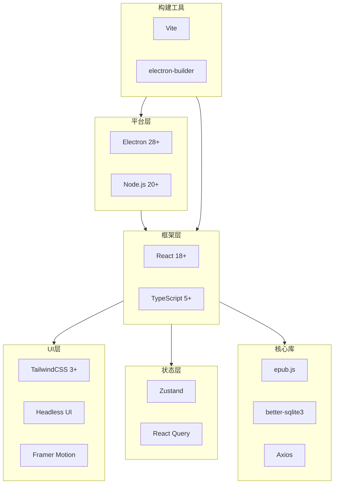

# K-Reader 技术栈说明文档

## 1. 技术栈概览

K-Reader采用现代化的技术栈，基于Electron构建跨平台桌面应用，使用React构建用户界面，TypeScript提供类型安全。

### 技术栈架构图



## 2. 核心依赖

### 2.1 Electron生态

#### electron `^28.0.0`
**用途**：跨平台桌面应用框架
**选择理由**：
- 成熟稳定，社区活跃
- 同时使用Web技术和Node.js能力
- 跨平台支持（Windows、macOS、Linux）
- 丰富的原生API

**主要功能**：
- 创建应用窗口
- 访问文件系统
- 系统集成（菜单、托盘等）
- 进程间通信

**安装**：
```bash
npm install electron --save-dev
```

#### electron-builder `^24.9.0`
**用途**：应用打包和分发工具
**选择理由**：
- 功能强大，配置灵活
- 支持多平台打包
- 自动处理代码签名
- 支持自动更新

**主要功能**：
- 生成安装包（exe、dmg、AppImage等）
- 代码签名和公证
- 差量更新
- 多语言支持

**安装**：
```bash
npm install electron-builder --save-dev
```

**配置示例**：
```json
{
  "build": {
    "appId": "com.kreader.app",
    "productName": "K-Reader",
    "mac": {
      "target": ["dmg", "zip"],
      "hardenedRuntime": true
    },
    "win": {
      "target": ["nsis", "portable"]
    }
  }
}
```

#### electron-store `^8.1.0`
**用途**：简单的数据持久化存储
**选择理由**：
- API简洁直观
- 自动JSON序列化
- 支持加密
- TypeScript类型支持

**主要功能**：
- 存储用户配置
- 应用状态持久化
- 窗口状态保存

**安装**：
```bash
npm install electron-store
```

**使用示例**：
```typescript
import Store from 'electron-store';

const store = new Store({
  defaults: {
    windowBounds: { width: 1200, height: 800 }
  }
});

store.set('theme', 'dark');
const theme = store.get('theme');
```

#### electron-updater `^6.1.7`
**用途**：自动更新功能
**选择理由**：
- 与electron-builder无缝集成
- 支持多种更新策略
- 差量更新节省流量
- 简单易用的API

**主要功能**：
- 检查更新
- 下载更新
- 安装更新
- 更新通知

**安装**：
```bash
npm install electron-updater
```

**使用示例**：
```typescript
import { autoUpdater } from 'electron-updater';

autoUpdater.checkForUpdatesAndNotify();
autoUpdater.on('update-available', (info) => {
  console.log('Update available:', info.version);
});
```

### 2.2 前端框架

#### react `^18.2.0`
**用途**：UI框架
**选择理由**：
- 生态系统成熟
- 组件化开发
- 虚拟DOM性能优秀
- Hooks API简洁强大
- 并发特性提升性能

**主要功能**：
- 组件化UI开发
- 状态管理
- 生命周期管理
- 事件处理

**安装**：
```bash
npm install react react-dom
```

**核心特性使用**：
```typescript
// Hooks
import { useState, useEffect, useMemo, useCallback } from 'react';

// Suspense
import { Suspense } from 'react';

// Error Boundary
import { ErrorBoundary } from 'react-error-boundary';
```

#### react-router-dom `^6.21.0`
**用途**：前端路由管理
**选择理由**：
- React官方推荐
- v6版本API简洁
- 支持嵌套路由
- 代码分割友好

**主要功能**：
- 页面路由
- 嵌套路由
- 路由守卫
- 路由参数

**安装**：
```bash
npm install react-router-dom
```

**使用示例**：
```typescript
import { BrowserRouter, Routes, Route } from 'react-router-dom';

<BrowserRouter>
  <Routes>
    <Route path="/" element={<Library />} />
    <Route path="/reader/:bookId" element={<Reader />} />
    <Route path="/settings" element={<Settings />} />
  </Routes>
</BrowserRouter>
```

#### typescript `^5.3.3`
**用途**：静态类型检查
**选择理由**：
- 类型安全
- 更好的IDE支持
- 减少运行时错误
- 代码自文档化
- 重构更安全

**主要功能**：
- 类型注解
- 接口定义
- 泛型
- 类型推断

**安装**：
```bash
npm install typescript --save-dev
npm install @types/react @types/react-dom @types/node --save-dev
```

**配置**：
```json
{
  "compilerOptions": {
    "target": "ES2020",
    "module": "ESNext",
    "lib": ["ES2020", "DOM"],
    "jsx": "react-jsx",
    "strict": true,
    "esModuleInterop": true,
    "skipLibCheck": true,
    "moduleResolution": "bundler"
  }
}
```

### 2.3 UI与样式

#### tailwindcss `^3.4.1`
**用途**：CSS框架
**选择理由**：
- 原子化CSS，开发快速
- 生产构建体积小
- 高度可定制
- 优秀的响应式支持
- 暗色模式原生支持

**主要功能**：
- 实用类样式
- 响应式设计
- 暗色模式
- 自定义主题

**安装**：
```bash
npm install tailwindcss postcss autoprefixer --save-dev
npx tailwindcss init -p
```

**配置示例**：
```javascript
// tailwind.config.js
module.exports = {
  content: ['./src/**/*.{js,jsx,ts,tsx}'],
  darkMode: 'class',
  theme: {
    extend: {
      colors: {
        primary: '#3b82f6',
        secondary: '#8b5cf6'
      }
    }
  }
}
```

#### @headlessui/react `^1.7.17`
**用途**：无样式UI组件库
**选择理由**：
- 完全可定制
- 无障碍支持优秀
- 与TailwindCSS完美配合
- API设计优雅

**主要功能**：
- Dialog（模态框）
- Menu（下拉菜单）
- Listbox（选择器）
- Transition（过渡动画）
- Tab（标签页）

**安装**：
```bash
npm install @headlessui/react
```

**使用示例**：
```typescript
import { Dialog, Transition } from '@headlessui/react';

<Dialog open={isOpen} onClose={setIsOpen}>
  <Dialog.Panel>
    <Dialog.Title>标题</Dialog.Title>
    {/* 内容 */}
  </Dialog.Panel>
</Dialog>
```

#### framer-motion `^11.0.3`
**用途**：React动画库
**选择理由**：
- 声明式API
- 性能优秀
- 手势支持
- 布局动画

**主要功能**：
- 组件动画
- 页面过渡
- 拖拽手势
- SVG动画

**安装**：
```bash
npm install framer-motion
```

**使用示例**：
```typescript
import { motion } from 'framer-motion';

<motion.div
  initial={{ opacity: 0 }}
  animate={{ opacity: 1 }}
  exit={{ opacity: 0 }}
>
  内容
</motion.div>
```

#### @heroicons/react `^2.1.1`
**用途**：图标库
**选择理由**：
- TailwindCSS官方图标
- SVG格式性能好
- 两种风格（outline/solid）
- TypeScript支持

**安装**：
```bash
npm install @heroicons/react
```

**使用示例**：
```typescript
import { BookOpenIcon } from '@heroicons/react/24/outline';

<BookOpenIcon className="w-6 h-6" />
```

### 2.4 状态管理

#### zustand `^4.4.7`
**用途**：轻量级状态管理
**选择理由**：
- API极简
- 无需Provider
- TypeScript支持好
- 支持中间件
- 性能优秀

**主要功能**：
- 全局状态
- 状态持久化
- 开发工具
- 中间件

**安装**：
```bash
npm install zustand
```

**使用示例**：
```typescript
import { create } from 'zustand';

interface BookStore {
  books: Book[];
  addBook: (book: Book) => void;
}

const useBookStore = create<BookStore>((set) => ({
  books: [],
  addBook: (book) => set((state) => ({
    books: [...state.books, book]
  }))
}));
```

#### @tanstack/react-query `^5.17.19`
**用途**：服务端状态管理
**选择理由**：
- 自动缓存
- 自动重新获取
- 乐观更新
- 分页和无限滚动
- 离线支持

**主要功能**：
- 数据获取
- 缓存管理
- 后台更新
- 查询失效

**安装**：
```bash
npm install @tanstack/react-query
```

**使用示例**：
```typescript
import { useQuery } from '@tanstack/react-query';

const { data, isLoading } = useQuery({
  queryKey: ['books'],
  queryFn: fetchBooks
});
```

### 2.5 阅读引擎

#### epubjs `^0.3.93`
**用途**：EPUB解析和渲染引擎
**选择理由**：
- EPUB标准完整支持
- CFI定位系统
- 渲染效果好
- API设计合理

**主要功能**：
- EPUB2/3解析
- 内容渲染
- CFI定位
- 样式注入
- 事件系统

**安装**：
```bash
npm install epubjs
```

**使用示例**：
```typescript
import ePub from 'epubjs';

const book = ePub(bookPath);
const rendition = book.renderTo('viewer', {
  width: '100%',
  height: '100%'
});

await rendition.display();
```

### 2.6 数据存储

#### better-sqlite3 `^9.2.2`
**用途**：SQLite数据库Node.js绑定
**选择理由**：
- 同步API性能好
- 适合Electron主进程
- 功能完整
- 稳定可靠

**主要功能**：
- SQL数据库
- 事务支持
- 预编译语句
- 备份功能

**安装**：
```bash
npm install better-sqlite3
npm install @types/better-sqlite3 --save-dev
```

**使用示例**：
```typescript
import Database from 'better-sqlite3';

const db = new Database('data.db');

// 查询
const books = db.prepare('SELECT * FROM books').all();

// 插入
const insert = db.prepare('INSERT INTO books VALUES (?, ?)');
insert.run(id, title);

// 事务
const insertMany = db.transaction((books) => {
  for (const book of books) insert.run(book.id, book.title);
});
```

#### idb `^7.1.1`
**用途**：IndexedDB封装库
**选择理由**：
- Promise API
- 类型安全
- 简化操作
- 体积小

**主要功能**：
- 存储大量数据
- 索引查询
- 事务支持

**安装**：
```bash
npm install idb
```

**使用示例**：
```typescript
import { openDB } from 'idb';

const db = await openDB('k-reader', 1, {
  upgrade(db) {
    db.createObjectStore('cache');
  }
});

await db.put('cache', value, key);
const value = await db.get('cache', key);
```

### 2.7 网络通信

#### axios `^1.6.5`
**用途**：HTTP客户端
**选择理由**：
- 功能完整
- 拦截器支持
- 自动转换
- 取消请求
- 超时处理

**主要功能**：
- HTTP请求
- 请求/响应拦截
- 错误处理
- 进度监控

**安装**：
```bash
npm install axios
```

**使用示例**：
```typescript
import axios from 'axios';

const api = axios.create({
  baseURL: 'https://api.example.com',
  timeout: 10000
});

// 请求拦截器
api.interceptors.request.use((config) => {
  config.headers.Authorization = `Bearer ${token}`;
  return config;
});

// 响应拦截器
api.interceptors.response.use(
  (response) => response.data,
  (error) => Promise.reject(error)
);
```

#### socket.io-client `^4.6.1`
**用途**：WebSocket客户端
**选择理由**：
- 自动重连
- 房间支持
- 事件系统
- 跨平台

**主要功能**：
- 实时通信
- 事件发射
- 房间管理
- 自动重连

**安装**：
```bash
npm install socket.io-client
```

**使用示例**：
```typescript
import { io } from 'socket.io-client';

const socket = io('ws://localhost:3000', {
  auth: { token }
});

socket.on('connect', () => {
  console.log('Connected');
});

socket.on('sync', (data) => {
  // 处理同步数据
});

socket.emit('update', data);
```

### 2.8 AI与智能服务

#### openai `^4.24.1`
**用途**：OpenAI API客户端
**选择理由**：
- 官方SDK
- 类型完整
- 流式支持
- 错误处理好

**主要功能**：
- GPT对话
- 流式响应
- 函数调用
- 嵌入向量

**安装**：
```bash
npm install openai
```

**使用示例**：
```typescript
import OpenAI from 'openai';

const openai = new OpenAI({
  apiKey: process.env.OPENAI_API_KEY
});

const completion = await openai.chat.completions.create({
  model: 'gpt-4',
  messages: [{ role: 'user', content: 'Hello' }]
});

// 流式响应
const stream = await openai.chat.completions.create({
  model: 'gpt-4',
  messages: [{ role: 'user', content: 'Hello' }],
  stream: true
});

for await (const chunk of stream) {
  console.log(chunk.choices[0]?.delta?.content);
}
```

### 2.9 工具库

#### dayjs `^1.11.10`
**用途**：日期时间处理
**选择理由**：
- 轻量级（2KB）
- API类似Moment.js
- 插件系统
- 国际化支持

**安装**：
```bash
npm install dayjs
```

**使用示例**：
```typescript
import dayjs from 'dayjs';
import relativeTime from 'dayjs/plugin/relativeTime';
import 'dayjs/locale/zh-cn';

dayjs.extend(relativeTime);
dayjs.locale('zh-cn');

dayjs().format('YYYY-MM-DD HH:mm:ss');
dayjs().fromNow(); // "几秒前"
```

#### uuid `^9.0.1`
**用途**：UUID生成
**选择理由**：
- 标准实现
- 性能好
- 多种版本支持

**安装**：
```bash
npm install uuid
npm install @types/uuid --save-dev
```

**使用示例**：
```typescript
import { v4 as uuidv4 } from 'uuid';

const id = uuidv4(); // '9b1deb4d-3b7d-4bad-9bdd-2b0d7b3dcb6d'
```

#### lodash-es `^4.17.21`
**用途**：实用工具库
**选择理由**：
- 功能全面
- ES模块版本
- Tree-shaking友好
- 性能优化好

**安装**：
```bash
npm install lodash-es
npm install @types/lodash-es --save-dev
```

**使用示例**：
```typescript
import { debounce, throttle, cloneDeep } from 'lodash-es';

const debouncedFn = debounce(fn, 300);
const throttledFn = throttle(fn, 1000);
const copy = cloneDeep(obj);
```

#### clsx `^2.1.0`
**用途**：className条件组合
**选择理由**：
- 轻量级（228B）
- 简单易用
- 性能好

**安装**：
```bash
npm install clsx
```

**使用示例**：
```typescript
import clsx from 'clsx';

const className = clsx(
  'base-class',
  isActive && 'active',
  { 'dark': isDark, 'light': !isDark }
);
```

## 3. 构建工具

### 3.1 Vite `^5.0.11`
**用途**：构建工具和开发服务器
**选择理由**：
- 极快的冷启动
- 即时热更新
- 优化的生产构建
- 插件生态丰富

**主要功能**：
- 开发服务器
- HMR热更新
- 生产构建
- 代码分割

**安装**：
```bash
npm install vite --save-dev
```

**配置示例**：
```typescript
// vite.config.ts
import { defineConfig } from 'vite';
import react from '@vitejs/plugin-react';
import path from 'path';

export default defineConfig({
  plugins: [react()],
  resolve: {
    alias: {
      '@': path.resolve(__dirname, './src')
    }
  },
  build: {
    outDir: 'dist',
    rollupOptions: {
      output: {
        manualChunks: {
          'react-vendor': ['react', 'react-dom'],
          'epub': ['epubjs']
        }
      }
    }
  }
});
```

### 3.2 electron-vite `^2.0.0`
**用途**：Electron + Vite集成
**选择理由**：
- 主进程和渲染进程统一构建
- 配置简单
- 开发体验好

**安装**：
```bash
npm install electron-vite --save-dev
```

## 4. 开发工具

### 4.1 代码质量

#### eslint `^8.56.0`
**用途**：代码检查
**选择理由**：
- 规则可配置
- 插件生态丰富
- TypeScript支持

**安装**：
```bash
npm install eslint --save-dev
npm install @typescript-eslint/parser @typescript-eslint/eslint-plugin --save-dev
npm install eslint-plugin-react eslint-plugin-react-hooks --save-dev
```

**配置示例**：
```json
{
  "extends": [
    "eslint:recommended",
    "plugin:@typescript-eslint/recommended",
    "plugin:react/recommended",
    "plugin:react-hooks/recommended"
  ],
  "rules": {
    "@typescript-eslint/no-explicit-any": "warn",
    "react/react-in-jsx-scope": "off"
  }
}
```

#### prettier `^3.1.1`
**用途**：代码格式化
**选择理由**：
- 零配置可用
- 多语言支持
- 编辑器集成好

**安装**：
```bash
npm install prettier --save-dev
npm install eslint-config-prettier --save-dev
```

**配置示例**：
```json
{
  "semi": true,
  "singleQuote": true,
  "tabWidth": 2,
  "trailingComma": "es5",
  "printWidth": 100
}
```

### 4.2 测试工具

#### vitest `^1.2.0`
**用途**：单元测试框架
**选择理由**：
- 与Vite完美集成
- 快速执行
- Jest兼容API
- TypeScript原生支持

**安装**：
```bash
npm install vitest --save-dev
npm install @vitest/ui --save-dev
```

**使用示例**：
```typescript
import { describe, it, expect } from 'vitest';

describe('BookService', () => {
  it('should import book', async () => {
    const book = await bookService.importBook(path);
    expect(book).toBeDefined();
  });
});
```

#### @testing-library/react `^14.1.2`
**用途**：React组件测试
**选择理由**：
- 用户行为导向
- 最佳实践
- 易于维护

**安装**：
```bash
npm install @testing-library/react @testing-library/jest-dom --save-dev
```

#### playwright `^1.40.1`
**用途**：E2E测试
**选择理由**：
- 跨浏览器支持
- 自动等待
- 强大的选择器
- 视频录制

**安装**：
```bash
npm install @playwright/test --save-dev
```

### 4.3 Git工具

#### husky `^8.0.3`
**用途**：Git hooks管理
**选择理由**：
- 简化hooks配置
- 团队协作友好

**安装**：
```bash
npm install husky --save-dev
npx husky install
```

#### lint-staged `^15.2.0`
**用途**：对暂存文件执行linter
**选择理由**：
- 只检查变更文件
- 提高效率

**安装**：
```bash
npm install lint-staged --save-dev
```

**配置示例**：
```json
{
  "lint-staged": {
    "*.{ts,tsx}": [
      "eslint --fix",
      "prettier --write"
    ]
  }
}
```

## 5. 可选依赖

### 5.1 PDF支持

#### pdfjs-dist `^3.11.174`
**用途**：PDF渲染
**安装**：
```bash
npm install pdfjs-dist
```

### 5.2 图片处理

#### sharp `^0.33.1`
**用途**：图片处理（压缩、裁剪等）
**安装**：
```bash
npm install sharp
```

### 5.3 文件处理

#### jszip `^3.10.1`
**用途**：ZIP文件处理（EPUB本质是ZIP）
**安装**：
```bash
npm install jszip
```

### 5.4 markdown

#### marked `^11.1.1`
**用途**：Markdown解析和渲染
**安装**：
```bash
npm install marked
npm install @types/marked --save-dev
```

### 5.5 导出PDF

#### jspdf `^2.5.1`
**用途**：生成PDF
**安装**：
```bash
npm install jspdf
```

## 6. package.json完整示例

```json
{
  "name": "k-reader",
  "version": "1.0.0",
  "description": "A powerful EPUB reader",
  "main": "dist-electron/main.js",
  "scripts": {
    "dev": "electron-vite dev",
    "build": "electron-vite build",
    "preview": "electron-vite preview",
    "typecheck": "tsc --noEmit",
    "lint": "eslint src --ext .ts,.tsx",
    "format": "prettier --write \"src/**/*.{ts,tsx,json,css}\"",
    "test": "vitest",
    "test:ui": "vitest --ui",
    "test:e2e": "playwright test",
    "pack": "electron-builder --dir",
    "dist": "electron-builder",
    "dist:win": "electron-builder --win",
    "dist:mac": "electron-builder --mac",
    "dist:linux": "electron-builder --linux",
    "prepare": "husky install"
  },
  "dependencies": {
    "@headlessui/react": "^1.7.17",
    "@heroicons/react": "^2.1.1",
    "@tanstack/react-query": "^5.17.19",
    "axios": "^1.6.5",
    "better-sqlite3": "^9.2.2",
    "clsx": "^2.1.0",
    "dayjs": "^1.11.10",
    "electron-store": "^8.1.0",
    "electron-updater": "^6.1.7",
    "epubjs": "^0.3.93",
    "framer-motion": "^11.0.3",
    "idb": "^7.1.1",
    "lodash-es": "^4.17.21",
    "openai": "^4.24.1",
    "react": "^18.2.0",
    "react-dom": "^18.2.0",
    "react-router-dom": "^6.21.0",
    "socket.io-client": "^4.6.1",
    "uuid": "^9.0.1",
    "zustand": "^4.4.7"
  },
  "devDependencies": {
    "@playwright/test": "^1.40.1",
    "@testing-library/jest-dom": "^6.1.5",
    "@testing-library/react": "^14.1.2",
    "@types/better-sqlite3": "^7.6.8",
    "@types/lodash-es": "^4.17.12",
    "@types/node": "^20.10.6",
    "@types/react": "^18.2.46",
    "@types/react-dom": "^18.2.18",
    "@types/uuid": "^9.0.7",
    "@typescript-eslint/eslint-plugin": "^6.17.0",
    "@typescript-eslint/parser": "^6.17.0",
    "@vitejs/plugin-react": "^4.2.1",
    "@vitest/ui": "^1.2.0",
    "autoprefixer": "^10.4.16",
    "electron": "^28.0.0",
    "electron-builder": "^24.9.0",
    "electron-vite": "^2.0.0",
    "eslint": "^8.56.0",
    "eslint-config-prettier": "^9.1.0",
    "eslint-plugin-react": "^7.33.2",
    "eslint-plugin-react-hooks": "^4.6.0",
    "husky": "^8.0.3",
    "lint-staged": "^15.2.0",
    "postcss": "^8.4.33",
    "prettier": "^3.1.1",
    "tailwindcss": "^3.4.1",
    "typescript": "^5.3.3",
    "vite": "^5.0.11",
    "vitest": "^1.2.0"
  },
  "lint-staged": {
    "*.{ts,tsx}": [
      "eslint --fix",
      "prettier --write"
    ],
    "*.{json,css,md}": [
      "prettier --write"
    ]
  }
}
```

## 7. 版本兼容性

### 7.1 Node.js版本

**推荐版本**：Node.js 20 LTS
**最低版本**：Node.js 18

**原因**：
- Electron 28需要Node.js 18+
- 更好的性能
- 更多的ES特性支持

### 7.2 Electron版本

**当前版本**：28.x
**Chrome版本**：120
**Node.js版本**：20.9.0

**升级策略**：
- 主版本更新：评估后谨慎升级
- 次版本更新：及时跟进
- 补丁版本：快速升级

### 7.3 浏览器支持

**渲染进程浏览器支持**：
- Chrome 120+ (Electron内置)
- 不需要考虑其他浏览器兼容性

## 8. 开发环境要求

### 8.1 操作系统

**开发**：
- Windows 10/11
- macOS 12+
- Ubuntu 20.04+

**打包**：
- Windows打包：需要Windows系统
- macOS打包：需要macOS系统（代码签名）
- Linux打包：任意平台

### 8.2 工具要求

- Node.js 20+
- npm 10+ 或 yarn 1.22+
- Git 2.30+
- Python 3.8+（编译原生模块）
- C++编译器（better-sqlite3）
  - Windows: Visual Studio Build Tools
  - macOS: Xcode Command Line Tools
  - Linux: GCC

### 8.3 IDE推荐

**推荐**：Visual Studio Code

**必备插件**：
- ESLint
- Prettier
- TypeScript and JavaScript Language Features
- Tailwind CSS IntelliSense
- Error Lens

**可选插件**：
- GitLens
- Import Cost
- Path Intellisense
- TODO Highlight

## 9. 技术选型总结

### 9.1 选型原则

1. **成熟稳定**：选择社区活跃、生产验证的技术
2. **类型安全**：优先TypeScript原生支持的库
3. **性能优先**：选择性能优秀的方案
4. **开发体验**：API设计优秀，开发效率高
5. **生态完整**：插件丰富，问题容易解决

### 9.2 技术优势

✅ **开发效率高**：
- Vite快速开发
- React组件化
- TailwindCSS快速UI
- TypeScript类型安全

✅ **性能优秀**：
- Electron原生性能
- React 18并发特性
- 虚拟化渲染
- better-sqlite3同步API

✅ **可维护性强**：
- 模块化架构
- TypeScript类型系统
- ESLint代码规范
- 完善测试

✅ **扩展性好**：
- 插件系统
- 主题系统
- 模块化设计
- 清晰的架构

### 9.3 潜在挑战

⚠️ **打包体积**：
- Electron基础体积大（~100MB）
- 解决：代码分割、资源压缩

⚠️ **性能优化**：
- 大文件渲染
- 解决：虚拟化、懒加载、Web Worker

⚠️ **跨平台兼容**：
- 不同平台API差异
- 解决：抽象层、条件编译

⚠️ **原生模块编译**：
- better-sqlite3需要编译
- 解决：提供预编译版本

## 10. 升级与维护

### 10.1 依赖更新策略

**定期更新**：
- 每月检查依赖更新
- 补丁版本及时更新
- 次版本评估后更新
- 主版本谨慎更新

**工具推荐**：
```bash
# 检查过期依赖
npm outdated

# 交互式更新
npx npm-check-updates -i

# 安全审计
npm audit
npm audit fix
```

### 10.2 Breaking Changes处理

1. 阅读更新日志
2. 检查breaking changes
3. 在开发分支测试
4. 运行完整测试套件
5. 更新相关代码
6. 更新文档

### 10.3 长期维护

- 保持依赖更新
- 修复安全漏洞
- 关注社区动态
- 收集用户反馈
- 持续优化性能

---

## 总结

K-Reader的技术栈经过精心选择，平衡了开发效率、性能、可维护性和用户体验。所有依赖都是经过生产验证的成熟方案，为项目的成功奠定了坚实的技术基础。

**核心价值**：
- 🚀 **高效开发**：现代化工具链，开发体验优秀
- ⚡ **性能卓越**：精选高性能库，优化策略完善
- 🛡️ **类型安全**：TypeScript全栈覆盖，减少错误
- 🎨 **体验优秀**：精美UI，流畅动画，响应迅速
- 🔧 **易于维护**：模块化设计，代码规范，测试完善

该技术栈将确保K-Reader成为一款优秀的Epub阅读器！
